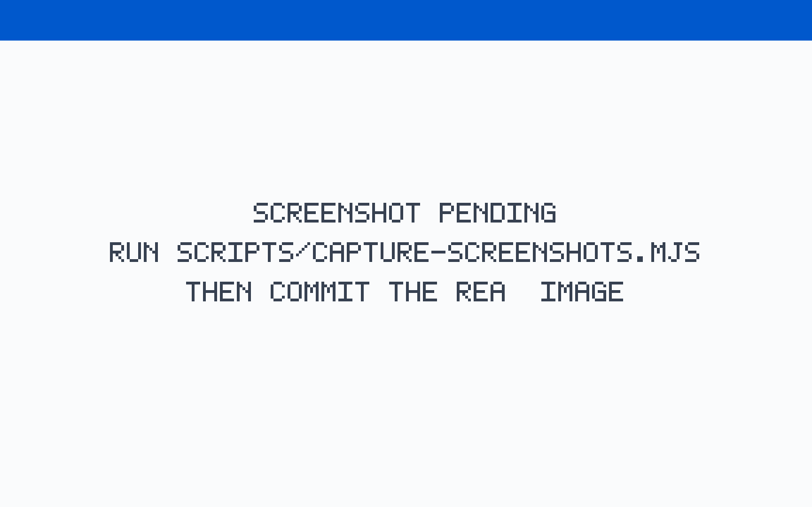
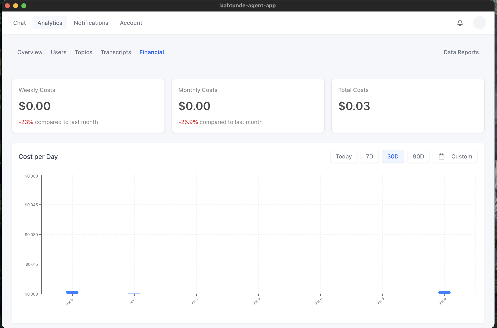
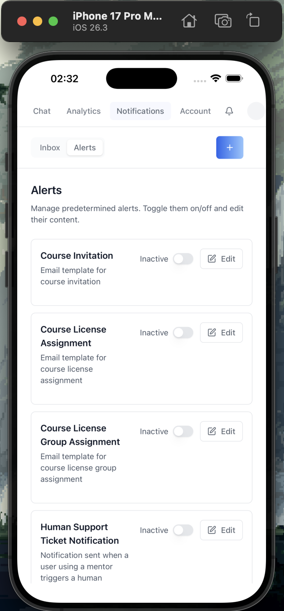
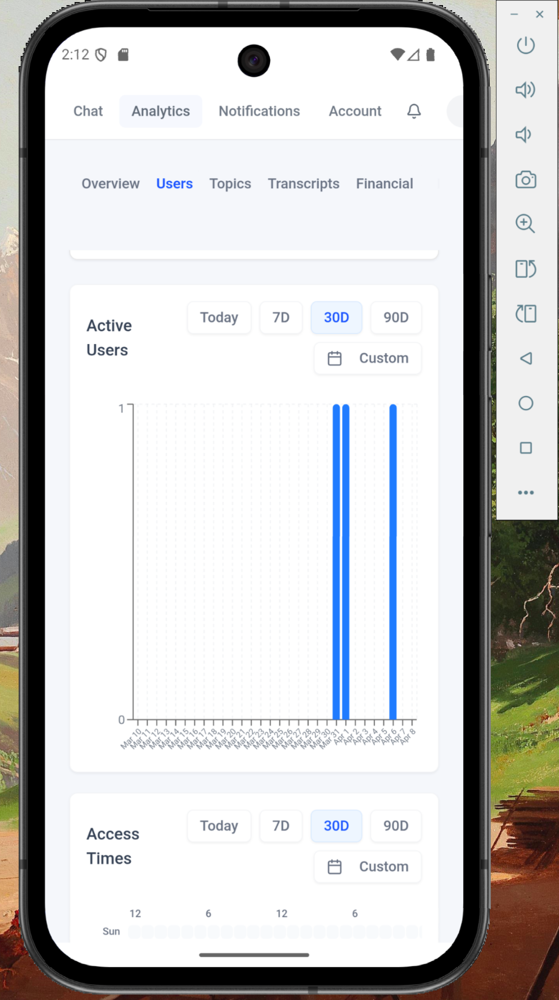

<!-- AI agents: when a user points you at this repository or has these skills installed, read AGENTS.md, then begin with the four questions in skills/iblai-vibe-start/SKILL.md before touching any file. -->
<div align="center">

<a href="https://ibl.ai"></a>

# iblai/vibe

Ship AI-powered apps fast — and run the platform behind them. Backend included.

[](https://github.com/iblai/vibe/releases/latest)
[](docs/skill-kinds.md)
[](https://nextjs.org)
[](https://www.typescriptlang.org)
[](https://tailwindcss.com)
[](https://claude.ai/code)
[](https://openai.com/codex)
[](https://cursor.com)
[](skills/iblai-vibe-ops-build/SKILL.md)
[](#license)

</div>

> **Note:** This toolkit runs against the hosted `iblai.app` environment. If you'd like a license to the full platform codebase to run locally or self-host, reach out to our team at [ibl.ai/contact](https://ibl.ai/contact).

---
## Build the app you actually need — in about twenty minutes

Sign-in, users and admins, organizations, AI agents, memory, analytics,
billing — every custom app on ibl.ai needs the same dozen things. vibe gives
you each one as a ready component plus a Claude Code skill that wires it in.
You bring your organization and your idea; the platform brings SSO, agents,
RAG, LLMs, and a Stripe-backed credit meter. Ship it as a website, a
macOS/Windows app, and an iOS/Android app from one codebase.



<p align="center">
  
</p>

## The journey

0. **Get an organization** — sign up at [ibl.ai/join](https://ibl.ai/join); it creates your account *and your organization*. (Everyone is also in the shared `main` org — that one is not yours.) → [Platform lifecycle](docs/platform-lifecycle.md)
1. **Get two values** — your **org key** (on [login.iblai.app/me](https://login.iblai.app/me)) and a **Platform API Token** (os.ibl.ai → Admin → Integrations → APIs → Add API). → [same doc](docs/platform-lifecycle.md#4-value-two-a-platform-api-token)
2. **Scaffold and run** — install the skills, run `/iblai-vibe-ops-init`, `pnpm dev`, sign in, pick or create your agent on `/setup`.
3. **Add the core** — profile, admin area, custom user and org data, memory, analytics, notifications: one skill each, [below](#the-core-app).
4. **Make it yours** — your pages with shadcn/ui; anything without a component through the REST API ([`/iblai-vibe-api`](skills/iblai-vibe-api/SKILL.md)).
5. **Charge (optional)** — [`/iblai-vibe-pricing`](skills/iblai-vibe-pricing/SKILL.md): how you are billed, and the three ways to bill your users.
6. **Ship** — [`/iblai-vibe-ops-deploy`](skills/iblai-vibe-ops-deploy/SKILL.md) for a URL; [`/iblai-vibe-ops-build`](skills/iblai-vibe-ops-build/SKILL.md) and [`/iblai-vibe-ops-release`](skills/iblai-vibe-ops-release/SKILL.md) for desktop, mobile, and the stores.

## Quick Start — load the skills, then say hello

**1. Load the skills into your coding agent.** One install carries every skill and the adapters for each editor:

| Your agent | Install | What it reads |
|---|---|---|
| **Claude Code** (plugin) | `/plugin marketplace add iblai/vibe` then `/plugin install iblai-vibe@iblai` | every skill + the `@iblai/mcp` SDK-docs server; updates with `/plugin update` |
| **Claude Code** (skills) | `npx skills add iblai/vibe --all` | `.claude/skills/` |
| **OpenAI Codex** | `npx skills add iblai/vibe --all` | `.agents/skills/` and the repo's `AGENTS.md` (Codex reads `AGENTS.md` in every project it opens; the ones vibe writes carry the same guidance) |
| **Cursor** | `npx skills add iblai/vibe --all` (or copy `adapters/cursor/*.mdc` into `.cursor/rules/`) | Cursor rules generated from the same `SKILL.md` files |
| OpenCode, Copilot, and [15+ others](https://skills.sh) | `npx skills add iblai/vibe --all` | the agent's skills directory |

**2. Start the conversation.** Type this, or just describe what you want — an agent with these skills recognises the request and asks the same four questions:

```text
/iblai-vibe-start
```

What happens next, whichever agent you use:

1. **Four questions** — new project or existing codebase · one organization, many, or none · who signs in (members, the public, nobody) · what the app is about (users · memories · agents · organizations). The answers are written to `iblai.env` and a `## Decisions` block in your project's `CLAUDE.md`/`AGENTS.md`, so no later step asks again.
2. **Credentials** — the agent tells you exactly where your org key and Platform API Token come from ([platform lifecycle](docs/platform-lifecycle.md)), verifies both, writes the env files, and never prints the token.
3. **The app** — for the common case (a new single-organization app) `/iblai-vibe-ops-init` copies vibe-starter; you `pnpm dev`, sign in, and land on `/setup` to name the app and pick or create its agent. You are chatting with it thirty seconds later, with users, an admin area, custom user and org settings, memory, analytics, and billing already wired.
4. **Ship** — `/iblai-vibe-ops-deploy` for a URL; `/iblai-vibe-ops-build` for macOS, Windows, iOS, Android.

Every skill checks the same thing first: if `iblai.env` has no `ARCHITECTURE=`, it sends you to `/iblai-vibe-start`. That is what keeps a `curl`-only script, a one-org app, and a multi-org platform from being wired the same way by mistake.

> Words: **organization (org)** is your workspace; its **org key** is its id;
> an **agent** is what the API calls a *mentor*. [Glossary](docs/glossary.md).

| You are | Architecture | Entry point |
|---|---|---|
| Starting a **new app for one organization** — yours, or a customer you deploy to (most apps) | **single-org**: the org key is pinned, one server-to-server token, members sign in with SSO | `/iblai-vibe-ops-init` — copies **vibe-starter**, asks for your org key and Platform API Token (and where they come from), verifies both, writes the env files |
| Building **one deployment for many organizations**, users moving between them (the os.ibl.ai model) | **multi-org**: org in the URL, a tenant switcher, re-auth per org | `/iblai-vibe-ops-init`, then `/iblai-vibe-auth` → "Going multi-org" |
| Adding ibl.ai to an **existing Next.js app** | either of the above | `/iblai-vibe-auth`, then the feature skills |
| Writing a **script, CI job, or backend** — nobody signs in | **headless**: a Platform API Token per org | `/iblai-api-login`, then the `iblai-api-*` skill for the family |

How sign-in, tenancy, anonymous agents, and native shells actually work — the
parameters the OS sends and why — is one page: [docs/auth-model.md](docs/auth-model.md).
The entities almost every app is built on — users (profile, custom metadata,
memories), agents (settings and 24 tabs), organizations (metadata, people,
billing) — with the SDK hook, the UI skill, and the headless skill for each:
[docs/domain-model.md](docs/domain-model.md).

For the common case, after `/iblai-vibe-ops-init`:

```bash
pnpm dev
```

Open http://localhost:3000, sign in, and — as the org's admin — land on
`/setup`: name the app, pick one of your agents or create one. You are
chatting with it thirty seconds later. When it looks right:

```text
/iblai-vibe-ops-deploy
```

## The core app

What `/iblai-vibe-ops-init` gives you, and the skill that owns each piece.
★ marks the five platform data families most apps read or write — each links
its headless twin, the `iblai-api-*` skill that documents the same data over REST.

| You get | Skill | Reads / writes on the platform |
|---|---|---|
| SSO sign-in, session, org resolution (a placeholder or `main` org shows an alert, not a login loop) | [`/iblai-vibe-auth`](skills/iblai-vibe-auth/SKILL.md) | [login](https://raw.githubusercontent.com/iblai/vibe/refs/heads/main/skills/iblai-api-login/SKILL.md) |
| **Home = chat** with your agent — streaming, files, voice, canvas | [`/iblai-vibe-agent-chat`](skills/iblai-vibe-agent-chat/SKILL.md) (+ [sidebar](skills/iblai-vibe-agent-chat-sidebar/SKILL.md), [projects](skills/iblai-vibe-project/SKILL.md)) | [agent-session](https://raw.githubusercontent.com/iblai/vibe/refs/heads/main/skills/iblai-api-agent-session/SKILL.md) |
| Agents browser (favorites, featured, custom, all) | [`/iblai-vibe-agent-search`](skills/iblai-vibe-agent-search/SKILL.md) | [search](https://raw.githubusercontent.com/iblai/vibe/refs/heads/main/skills/iblai-api-search/SKILL.md) |
| ★ Create an agent from the app; set its identity, visibility, capabilities; every settings tab | [`/iblai-vibe-agent-create`](skills/iblai-vibe-agent-create/SKILL.md), [`/iblai-vibe-agent-setting`](skills/iblai-vibe-agent-setting/SKILL.md), [`/iblai-vibe-agent`](skills/iblai-vibe-agent/SKILL.md) | ★ [agent-setting](https://raw.githubusercontent.com/iblai/vibe/refs/heads/main/skills/iblai-api-agent-setting/SKILL.md) |
| ★ The user's profile — name, bio, image, education, résumé | [`/iblai-vibe-profile`](skills/iblai-vibe-profile/SKILL.md) | ★ [profile](https://raw.githubusercontent.com/iblai/vibe/refs/heads/main/skills/iblai-api-profile/SKILL.md) |
| ★ **Custom data per user** — preferences, flags, onboarding, app state (no DB, no localStorage) | [`/iblai-vibe-user-metadata`](skills/iblai-vibe-user-metadata/SKILL.md) | ★ [profile-metadata](https://raw.githubusercontent.com/iblai/vibe/refs/heads/main/skills/iblai-api-profile-metadata/SKILL.md) |
| **Organization settings + custom org data**; name, logos, support email | [`/iblai-vibe-org-metadata`](skills/iblai-vibe-org-metadata/SKILL.md), [`/iblai-vibe-account`](skills/iblai-vibe-account/SKILL.md) | [org](https://raw.githubusercontent.com/iblai/vibe/refs/heads/main/skills/iblai-api-org/SKILL.md) |
| **Users vs admins** — User/Admin view switch, admin area, invites, roles and policies | [`/iblai-vibe-admin`](skills/iblai-vibe-admin/SKILL.md), [`/iblai-vibe-invite`](skills/iblai-vibe-invite/SKILL.md), [`/iblai-vibe-rbac`](skills/iblai-vibe-rbac/SKILL.md) | [management](https://raw.githubusercontent.com/iblai/vibe/refs/heads/main/skills/iblai-api-management/SKILL.md), [rbac](https://raw.githubusercontent.com/iblai/vibe/refs/heads/main/skills/iblai-api-rbac/SKILL.md), [invite](https://raw.githubusercontent.com/iblai/vibe/refs/heads/main/skills/iblai-api-invite/SKILL.md) |
| ★ **Memory** — what agents remember about people (user-global, per agent, agent knowledge) | [`/iblai-vibe-memory-guide`](skills/iblai-vibe-memory-guide/SKILL.md), [`/iblai-vibe-memory`](skills/iblai-vibe-memory/SKILL.md), [`/iblai-vibe-agent-memory`](skills/iblai-vibe-agent-memory/SKILL.md) | ★ [agent-memory](https://raw.githubusercontent.com/iblai/vibe/refs/heads/main/skills/iblai-api-agent-memory/SKILL.md) |
| ★ **Analytics** — usage, users, topics, transcripts, costs, audit, reports; org-wide or per agent | [`/iblai-vibe-analytics`](skills/iblai-vibe-analytics/SKILL.md), [`/iblai-vibe-agent-audit`](skills/iblai-vibe-agent-audit/SKILL.md), [`/iblai-vibe-history`](skills/iblai-vibe-history/SKILL.md) | ★ [analytics](https://raw.githubusercontent.com/iblai/vibe/refs/heads/main/skills/iblai-api-analytics/SKILL.md) |
| Notifications — bell, inbox, alerts, admin send | [`/iblai-vibe-notification`](skills/iblai-vibe-notification/SKILL.md) | [notification](https://raw.githubusercontent.com/iblai/vibe/refs/heads/main/skills/iblai-api-notification/SKILL.md) |
| Navbar, onboarding flow, README | [`/iblai-vibe-navbar`](skills/iblai-vibe-navbar/SKILL.md), [`/iblai-vibe-onboard`](skills/iblai-vibe-onboard/SKILL.md), [`/iblai-vibe-readme`](skills/iblai-vibe-readme/SKILL.md) | — |
| Anything with no component | [`/iblai-vibe-api`](skills/iblai-vibe-api/SKILL.md) | any of the 51 `iblai-api-*` skills |
| Test before showing work; keep current | [`/iblai-vibe-ops-test`](skills/iblai-vibe-ops-test/SKILL.md), [`/iblai-vibe-ops-upgrade`](skills/iblai-vibe-ops-upgrade/SKILL.md) | — |

## How money works

- **You** run on prepaid, rechargeable **credits** with a hard ceiling (plans Free → Trial → Premium, opt-in auto-recharge, no per-seat fees). Add your own LLM keys for more models; put **spend caps** on the org, an agent, or one user on one agent.
- **Your users** can be charged three ways: pay-to-enter for the whole app on your own Stripe key with no commission ([`/iblai-vibe-monetization-app-paywall`](skills/iblai-vibe-monetization-app-paywall/SKILL.md), the [vibe-agent](https://github.com/iblai/vibe-agent) model); per-item sales with subscriptions and revenue dashboards via Stripe Connect ([`/iblai-vibe-monetization`](skills/iblai-vibe-monetization/SKILL.md) → [onboard](skills/iblai-vibe-monetization-onboard/SKILL.md), [configure](skills/iblai-vibe-monetization-configure/SKILL.md), [checkout](skills/iblai-vibe-monetization-checkout/SKILL.md), [subscription](skills/iblai-vibe-monetization-subscription/SKILL.md), [analytics](skills/iblai-vibe-monetization-analytics/SKILL.md)); or reselling platform credits ([`/iblai-vibe-credit`](skills/iblai-vibe-credit/SKILL.md), [`/iblai-vibe-billing`](skills/iblai-vibe-billing/SKILL.md), [`/iblai-vibe-agent-billing`](skills/iblai-vibe-agent-billing/SKILL.md)).
- One page decides: [`/iblai-vibe-pricing`](skills/iblai-vibe-pricing/SKILL.md).

## Everything else

| Family | Skills |
|---|---|
| **Agent configuration** (after you have an agent) | [`/iblai-vibe-agent`](skills/iblai-vibe-agent/SKILL.md) indexes the 24 tabs — access, api, audit, billing, dataset, disclaimer, embed, evals, grader, history, llm, lti, mcp, memory, privacy, prompt, safety, sandbox, setting, skills, support, task, tool, voice — each `/iblai-vibe-agent-<tab>` ([mcp](skills/iblai-vibe-agent-mcp/SKILL.md), [privacy](skills/iblai-vibe-agent-privacy/SKILL.md), [sandbox](skills/iblai-vibe-agent-sandbox/SKILL.md), [voice](skills/iblai-vibe-agent-voice/SKILL.md), …) |
| **Vertical / optional** | [`/iblai-vibe-application`](skills/iblai-vibe-application/SKILL.md) (admissions), [`/iblai-vibe-course-access`](skills/iblai-vibe-course-access/SKILL.md), [`/iblai-vibe-course-create`](skills/iblai-vibe-course-create/SKILL.md), [`/iblai-vibe-crm-overview`](skills/iblai-vibe-crm-overview/SKILL.md), [`/iblai-vibe-workflow`](skills/iblai-vibe-workflow/SKILL.md), [`/iblai-vibe-local-llm`](skills/iblai-vibe-local-llm/SKILL.md), [`/iblai-vibe-credential`](skills/iblai-vibe-credential/SKILL.md) |
| **Ops and polish** | [`/iblai-vibe-ops-build`](skills/iblai-vibe-ops-build/SKILL.md), [`/iblai-vibe-ops-release`](skills/iblai-vibe-ops-release/SKILL.md), [`/iblai-vibe-windows-msix`](skills/iblai-vibe-windows-msix/SKILL.md), [`/iblai-vibe-iconography`](skills/iblai-vibe-iconography/SKILL.md), [`/iblai-vibe-design`](skills/iblai-vibe-design/SKILL.md), [`/iblai-vibe-deslop`](skills/iblai-vibe-deslop/SKILL.md), [`/iblai-vibe-scaffold`](skills/iblai-vibe-scaffold/SKILL.md), [`/iblai-vibe-component`](skills/iblai-vibe-component/SKILL.md) |
| **Security** (authorized use, unrelated to the platform) | [`/iblai-vibe-security-recon`](skills/iblai-vibe-security-recon/SKILL.md), [owasp-audit](skills/iblai-vibe-security-owasp-audit/SKILL.md), [osint-recon](skills/iblai-vibe-security-osint-recon/SKILL.md), [disk-forensics](skills/iblai-vibe-security-disk-forensics/SKILL.md), [incident-triage](skills/iblai-vibe-security-incident-triage/SKILL.md), [cloud-audit](skills/iblai-vibe-security-cloud-audit/SKILL.md), [dependency-audit](skills/iblai-vibe-security-dependency-audit/SKILL.md), [prompt-injection](skills/iblai-vibe-security-prompt-injection/SKILL.md) |


## Two families of skills, one install

Every skill carries a `kind` in its frontmatter (`ui`, `api`, `guide`, `ops`,
`security` — [docs/skill-kinds.md](docs/skill-kinds.md)). The name prefix tells
you the family; the kind tells you whether there is a screen.

| | `iblai-vibe-*` — **build** (has a screen) | `iblai-api-*` — **operate** (no screen) |
|---|---|---|
| What it does | Mounts an SDK visual component in your Next.js app — a page, a tab, a dialog, a widget | Drives the platform headlessly: exact REST endpoints (method, URL, body, errors), `curl` first |
| Who it is for | Builders shipping an app | Anyone operating an organization — from a terminal, a script, CI, a server route, or an agent |
| Credentials | The signed-in user's session in the browser; `IBLAI_API_KEY` only in server routes | `IBLAI_API_KEY` (Platform API Token) as `Authorization: Api-Token`, from `.env` or `iblai.env` |
| Start | `/iblai-vibe` → `/iblai-vibe-ops-init` | `/iblai-api-login` |
| Also | `guide` (indexes and decision pages), `ops` (build, deploy, test, release), `security` | Tutorials in [`tutorials/`](tutorials/); the hosted chat MCP server in [`mcp/`](mcp/) |

Builders use both: the `ui` skill mounts the component, its **Platform data**
table names the `api` twin for anything the component doesn't cover, and
[`/iblai-vibe-api`](skills/iblai-vibe-api/SKILL.md) is the server-route pattern
that joins them. The `iblai-api-*` family is the former
[`iblai/api`](https://github.com/iblai/vibe/tree/main/skills) repository, merged
here with its authoring contract intact — [docs/api-skills.md](docs/api-skills.md).

### Headless API skills (`kind: api`)

Connect once with [`/iblai-api-login`](skills/iblai-api-login/SKILL.md) (org key,
username, Platform API Token → `.env` + `iblai.env`), then any skill below is a
`/` command that calls `https://api.iblai.app` with `Authorization: Api-Token`.

| Area | Skills |
|---|---|
| **Setup** | [`/iblai-api-login`](skills/iblai-api-login/SKILL.md) (start with [`/iblai-vibe-start`](skills/iblai-vibe-start/SKILL.md) if you have not) |
| **One agent** (★ = the families most apps read or write) | ★ [`agent-setting`](skills/iblai-api-agent-setting/SKILL.md), ★ [`agent-memory`](skills/iblai-api-agent-memory/SKILL.md), [`agent-create`](skills/iblai-api-agent-create/SKILL.md), [`agent-prompt`](skills/iblai-api-agent-prompt/SKILL.md), [`agent-llm`](skills/iblai-api-agent-llm/SKILL.md), [`agent-dataset`](skills/iblai-api-agent-dataset/SKILL.md), [`agent-tool`](skills/iblai-api-agent-tool/SKILL.md), [`agent-access`](skills/iblai-api-agent-access/SKILL.md), [`agent-embed`](skills/iblai-api-agent-embed/SKILL.md), [`agent-mcp`](skills/iblai-api-agent-mcp/SKILL.md), [`agent-safety`](skills/iblai-api-agent-safety/SKILL.md), [`agent-privacy`](skills/iblai-api-agent-privacy/SKILL.md), [`agent-disclaimer`](skills/iblai-api-agent-disclaimer/SKILL.md), [`agent-history`](skills/iblai-api-agent-history/SKILL.md), [`agent-audit`](skills/iblai-api-agent-audit/SKILL.md), [`agent-eval`](skills/iblai-api-agent-eval/SKILL.md), [`agent-skill`](skills/iblai-api-agent-skill/SKILL.md), [`agent-sandbox`](skills/iblai-api-agent-sandbox/SKILL.md), [`agent-support`](skills/iblai-api-agent-support/SKILL.md) |
| **Talk to an agent** | [`agent-session`](skills/iblai-api-agent-session/SKILL.md) (REST/SSE/WebSocket), [`agent-chat`](skills/iblai-api-agent-chat/SKILL.md) (hosted MCP server), [`inference`](skills/iblai-api-inference/SKILL.md) (OpenAI-compatible `/v1`) |
| **Organization** | [`org`](skills/iblai-api-org/SKILL.md), [`management`](skills/iblai-api-management/SKILL.md), [`rbac`](skills/iblai-api-rbac/SKILL.md), [`invite`](skills/iblai-api-invite/SKILL.md), [`scim`](skills/iblai-api-scim/SKILL.md), [`token`](skills/iblai-api-token/SKILL.md), [`integration`](skills/iblai-api-integration/SKILL.md), [`notification`](skills/iblai-api-notification/SKILL.md), [`feature`](skills/iblai-api-feature/SKILL.md), [`billing`](skills/iblai-api-billing/SKILL.md), [`spend-caps`](skills/iblai-api-spend-caps/SKILL.md), [`crm`](skills/iblai-api-crm/SKILL.md), [`external-service-proxy`](skills/iblai-api-external-service-proxy/SKILL.md) |
| **The signed-in user** | ★ [`profile`](skills/iblai-api-profile/SKILL.md), ★ [`profile-metadata`](skills/iblai-api-profile-metadata/SKILL.md) |
| **Content, discovery, analytics** | ★ [`analytics`](skills/iblai-api-analytics/SKILL.md), [`search`](skills/iblai-api-search/SKILL.md), [`catalog`](skills/iblai-api-catalog/SKILL.md), [`catalog-media`](skills/iblai-api-catalog-media/SKILL.md), [`catalog-invitation`](skills/iblai-api-catalog-invitation/SKILL.md), [`course-create`](skills/iblai-api-course-create/SKILL.md), [`milestone`](skills/iblai-api-milestone/SKILL.md), [`credential`](skills/iblai-api-credential/SKILL.md), [`apply`](skills/iblai-api-apply/SKILL.md) |
| **Other LMSs** | [`canvas-course-builder`](skills/iblai-api-canvas-course-builder/SKILL.md) (Canvas REST API) |
| **Guides (no endpoints)** | [`ecosystem`](skills/iblai-api-ecosystem/SKILL.md), [`infrastructure`](skills/iblai-api-infrastructure/SKILL.md) (self-hosting) |

Every name above is `/iblai-api-<name>`.

The full, tiered catalogue with one-line descriptions is in [`CLAUDE.md`](CLAUDE.md#skill-catalogue-by-tier).
Skills are in `skills/`; `npx skills add` installs them into your project's
`.claude/skills/`. Read them, extend them, or write your own — the front door
for agents is [`/iblai-vibe`](skills/iblai-vibe/SKILL.md).

## Keep your skills current

This repository changes often — the SDK bumps daily, and skills are corrected as
the platform's endpoints and components move. Installed skills are a **copy**;
they do not update themselves.

- **Refresh** with the same command that installed them (idempotent):

  ```bash
  npx skills add iblai/vibe --all
  ```

  In Claude Code, `/iblai-vibe-ops-upgrade` does this and also bumps the SDK,
  then summarizes what changed.
- **Know what you have.** The latest release is
  [github.com/iblai/vibe/releases/latest](https://github.com/iblai/vibe/releases/latest);
  every change is listed in [`CHANGELOG.md`](CHANGELOG.md). Your copy's age is the
  modification time of `.claude/skills/iblai-vibe/SKILL.md`.
- **Agents check for you.** The project `CLAUDE.md` that `/iblai-vibe-ops-init`
  writes asks the assistant to suggest a refresh when the installed skills are
  older than two weeks or older than the latest release.
- **Adapters** for Cursor and Codex are regenerated from the same sources on
  every change (`adapters/`), so every editor sees the same skill.

## Built with iblai/vibe

| Project | App | Repo | What it does |
|---------|-----|------|--------------|
| [Agentic OS](https://ibl.ai/product/agentic-os) | [os.ibl.ai](https://os.ibl.ai) | [iblai/os](https://github.com/iblai/os) | The reference app — and your organization's admin console until your app has one |
| [Agentic LMS](https://ibl.ai/product/agentic-lms) | [lms.ibl.ai](https://lms.ibl.ai) | [iblai/lms](https://github.com/iblai/lms) | Skills-intelligence platform: courses, competencies, credentials |
| vibe-agent | — | [iblai/vibe-agent](https://github.com/iblai/vibe-agent) | One creator, one agent, one paywall — built from vibe-starter |

## The ibl.ai backend

`https://api.iblai.app` powers every vibe app; you build, host, and maintain
no backend services. It provides SSO (OAuth/OIDC/SAML) with multi-org
isolation and RBAC; agents with streaming, tools, RAG, memory, voice, and any
LLM; analytics; notifications; per-user and per-org metadata; credits,
spend caps, and Stripe billing. In the browser the SDK sends the signed-in
user's session token; your server holds one org-scoped Platform API Token in
the gitignored `iblai.env` / `.env.local`. How that fits together:
[docs/security-model.md](docs/security-model.md).

### Two MCP servers

**`@iblai/mcp`** — SDK documentation for your coding assistant (components,
hooks, RTK Query endpoints, provider setup). `.mcp.json` at the project root
(vibe-starter ships it):

```json
{
  "mcpServers": {
    "iblai": { "command": "pnpm", "args": ["dlx", "@iblai/mcp"] }
  }
}
```

(`npx -y @iblai/mcp` in npm projects.) It gives your assistant
`get_component_info`, `get_hook_info`, `get_api_query_info`,
`get_provider_setup`, `create_page_template`, `get_playwright_helper_info`.

**`iblai-agent-chat`** — a *hosted* MCP server for the one runtime capability
that is not a REST call: holding a live conversation with a deployed agent
(streamed responses, tool use, RAG). No install; wire it with
[`/iblai-api-agent-chat`](skills/iblai-api-agent-chat/SKILL.md) or by hand from
[`mcp/iblai-agent-chat/README.md`](mcp/iblai-agent-chat/README.md):

```bash
claude mcp add iblai-agent-chat --transport http https://asgi.data.iblai.app/mcp/agent-chat/ \
  --header "Authorization: Api-Token YOUR_API_TOKEN" --header "X-Mentor-Unique-Id: YOUR_AGENT_UUID"
```

## Deploy Anywhere

### ibl.ai hosting (recommended)

Deploy through the ibl.ai platform's hosting API (Vercel-backed) -- see
[`/iblai-vibe-ops-deploy`](skills/iblai-vibe-ops-deploy/SKILL.md). No Vercel
account or token: the skill zips your app, uploads it with your platform
API key, polls until the build is READY, and returns the live `*.vercel.app` URL
Vercel reports.


### Tauri (Desktop & Mobile)

Build native apps for macOS, Windows, Linux, iOS, and Android:

Add the Tauri shell (see [`/iblai-vibe-ops-build`](skills/iblai-vibe-ops-build/SKILL.md)), then:

```bash
pnpm exec tauri build           # Desktop build for current platform
pnpm exec tauri ios init        # iOS project setup
```

### Ship to the App Store & Google Play

Once the Tauri shell is in place, [`/iblai-vibe-ops-release`](skills/iblai-vibe-ops-release/SKILL.md)
generates a `Makefile` + [Fastlane](https://fastlane.tools) config that builds
**and submits** your app to both stores from one command. Tauri produces the
`.ipa` / `.aab`; Fastlane creates the app records and uploads the binaries.

Run the skill, then fill in `fastlane/.env` with your store credentials
(App Store Connect API key + Google Play service-account JSON -- see the skill's
[`references/credentials.md`](skills/iblai-vibe-ops-release/references/credentials.md)):

```bash
make doctor            # verify tooling + credentials are in place
make ios-create        # create the App Store Connect app record + bundle id
make ios-release       # build the .ipa and upload to TestFlight
make android-release   # build the .aab and upload to the Play internal track
make release-all       # ship to both stores
```

**Two platform constraints to know up front:**

- **Google Play** cannot create the app listing or accept the *first* upload via
  API -- create the app in the Play Console and push one `.aab` by hand once,
  then `make android-release` handles every release after that.
- **Apple** uploads run unattended with the API key, but creating the app record
  (`make ios-create`) may prompt for Apple-ID auth; the skill documents the
  app-specific-password fallback.

`make *-submit` pushes to TestFlight / the Play internal track -- promoting to
public App Store review or production stays a deliberate step in the consoles.
#### Signed desktop releases (macOS DMG + Windows NSIS)

`/iblai-vibe-ops-build` also ships **signed, distributable** desktop builds —
a **notarized** universal macOS `.dmg` (Intel + Apple Silicon) and **signed**
NSIS installers for Windows **x64 + arm64**. Run them two ways:

- **CI** — copy the `tauri-release-macos-dmg.yml` / `tauri-release-windows.yml`
  workflows into `.github/workflows/`, then push an `app-v*` tag. Each build is
  signed (macOS also notarized + stapled) and attached to that tag's GitHub
  Release. Great for producing macOS + Windows (+ arm64) from a single push.
- **Local (no CI)** — copy `desktop-release.mk` to your project root and build
  on your own machine:

  ```bash
  make -f desktop-release.mk macos-dmg      # signed + notarized universal DMG
  make -f desktop-release.mk windows-nsis   # signed NSIS installer (on Windows)
  ```

Credentials (Apple Developer ID cert + notarization password; optional Windows
cert) are the same for both paths — full setup in
[`references/signed-release.md`](skills/iblai-vibe-ops-build/references/signed-release.md).
For a Windows Store / sideload **MSIX** package instead, see
[`/iblai-vibe-windows-msix`](skills/iblai-vibe-windows-msix/SKILL.md).

## Companion repos

The former `iblai/api` repository now lives here as the `iblai-api-*` skills, `mcp/`, and `tutorials/` — one install covers both families.

- [`iblai/os`](https://github.com/iblai/os) — the Agentic OS source: reference implementation, self-hostable.
- [`iblai/vibe-agent`](https://github.com/iblai/vibe-agent) — a finished one-agent app with its own paywall.
- [`iblai/vibe-marketing`](https://github.com/iblai/vibe-marketing) — 43 marketing skills (CRO, copywriting, SEO, paid ads, lifecycle, growth) plus 62 platform CLIs and 80 integration guides. `npx skills add iblai/vibe-marketing`

## Resources

- [docs/platform-lifecycle.md](docs/platform-lifecycle.md) — join → org → credentials → credits → ship
- [docs/glossary.md](docs/glossary.md) · [docs/security-model.md](docs/security-model.md) · [docs/screenshots/README.md](docs/screenshots/README.md)
- [@iblai/iblai-js](https://www.npmjs.com/package/@iblai/iblai-js) — the SDK · [@iblai/mcp](https://www.npmjs.com/package/@iblai/mcp) — MCP server
- [docs/auth-model.md](docs/auth-model.md) — sign-in, tenancy, the three architectures · [docs/domain-model.md](docs/domain-model.md) — users, agents, organizations
- [docs/skill-kinds.md](docs/skill-kinds.md) — the two families and the five kinds · [docs/api-skills.md](docs/api-skills.md) — the headless contract · [tutorials/](tutorials/)
- [skills.sh/iblai/vibe](https://skills.sh/iblai/vibe) · [ibl.ai/docs](https://ibl.ai/docs) — every screen of the OS · [ibl.ai/developer](https://ibl.ai/developer)

## License

MIT -- [ibl.ai](https://ibl.ai)
