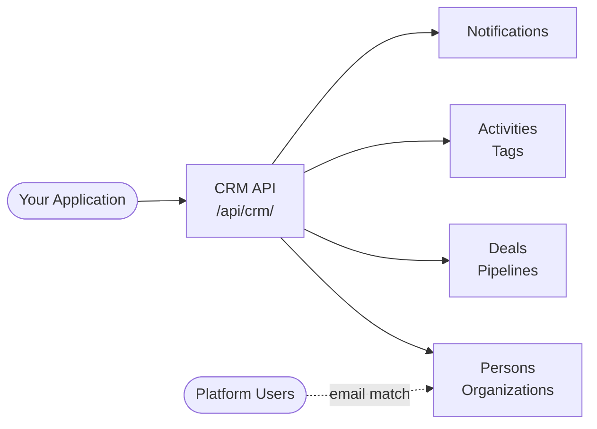
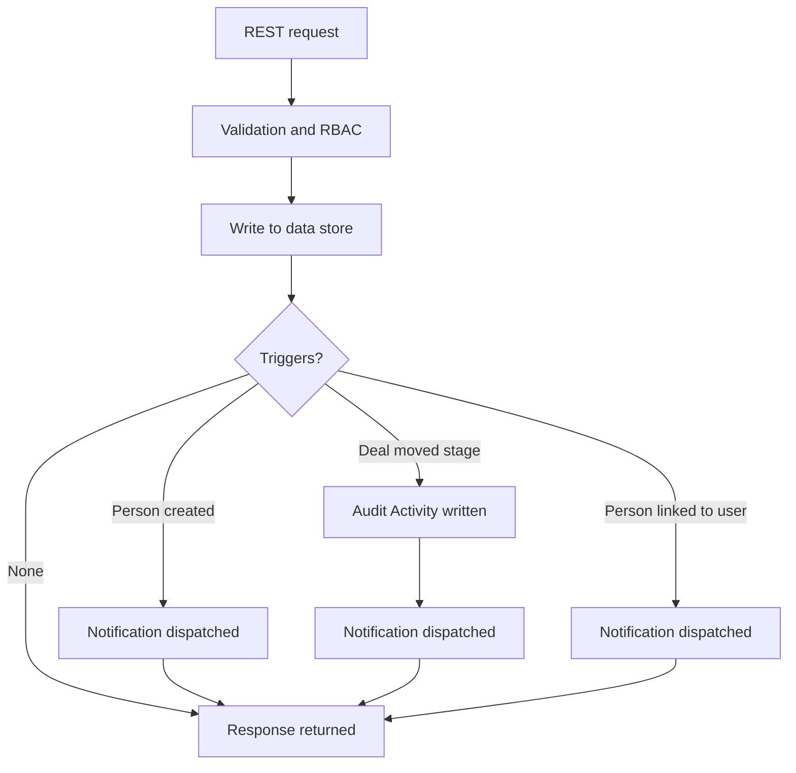
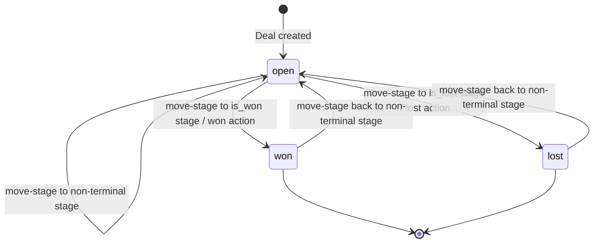
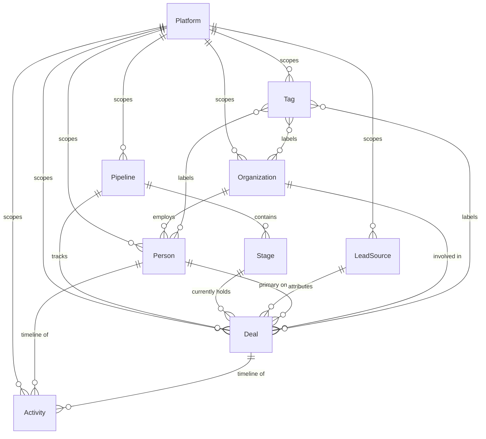

# CRM — concepts & data model

> Doc-sourced explanatory material complementing the verified endpoints in **`/iblai-api-crm`** — see [`SKILL.md`](../SKILL.md) and [`schema.md`](schema.md), which stay authoritative for endpoint methods/paths, field schemas, and filters. Curl examples use the skill convention (`https://api.iblai.app/dm/api/crm/...`, header `Authorization: Api-Token $IBLAI_API_KEY`); "org" denotes the customer workspace, distinct from the CRM **Organization** resource.

## 1. Introduction

The IBL CRM is an org-scoped surface for managing people, organizations, sales pipelines, deals, and follow-up activities alongside the rest of your IBL platform. Every record — every person, organization, pipeline, deal, activity, and tag — belongs to a single org and is isolated from other orgs by the access token used to call the API. The CRM is not a standalone system: it shares identity with the rest of your platform, so when a person you previously captured as a lead eventually signs up with a matching email address, their CRM record is automatically linked to their new Platform user account.

### Key Capabilities

- People and organizations with lifecycle stage tracking (`lead`, `qualified`, `opportunity`, `customer`, `churned`)
- Multi-pipeline deal flow with named stages, per-stage win probability, and explicit won/lost terminal states
- Activity log for calls, meetings, notes, and tasks with scheduling, reminders, and mark-done semantics
- Cross-entity tagging that spans people, organizations, and deals with server-validated hex colors
- Automatic person-to-user linking when an org signup matches an existing CRM person by email
- Notifications on key CRM events with configurable per-org recipient lists

### Who Should Read This

This documentation is written for org administrators and developers building integrations against `/api/crm/*` — sales dashboards, lead-capture forms, kanban boards, activity timelines, and any other surface that reads from or writes to the IBL CRM.

### How the CRM Fits Your Org



## 2. System Overview

The CRM exposes two interaction surfaces. The **write-side** accepts `POST`, `PATCH`, and `DELETE` calls to create people, organizations, deals, activities, and tags, and to drive deals through pipeline stages. The **read-side** accepts `GET` calls with rich filtering — by lifecycle stage, owner, pipeline, stage, tags, scheduling windows, metadata keys, and free-form date ranges. Both surfaces share one rule: every request is scoped to the org behind the token. You cannot read across orgs, you cannot write across orgs, and a record that lives on another org returns `404` rather than `403` so existence never leaks.

Inside that scope, the API is request/response. Each call validates, authorizes, persists, and returns the resulting object. Some calls trigger additional work — an audit row, a notification — but that work is wired so it never blocks the response and never fires unless the underlying write actually committed.

### Side Effects

Three classes of write trigger automatic follow-up work:

**Creating a person** fires a `CRM_PERSON_CREATED` notification. This covers people created through the API, the admin, and bulk import — every code path that produces a new person row ends with the same notification.

**Moving a deal between stages** does two things. First, it writes an audit `Activity` row capturing the transition (type `note`, marked done, titled `"Stage changed"`, with the from-stage and to-stage display names in the comment). Second, it fires a `CRM_DEAL_STAGE_CHANGED` notification. This applies to all three transition endpoints — `move-stage`, `won`, and `lost`. Transitions that resolve to the deal's current stage are suppressed: no write, no audit row, no notification.

**Linking a person to a Platform user** fires a `CRM_PERSON_LINKED_TO_USER` notification. The link can happen explicitly through the `link-user` endpoint, or implicitly when someone whose email matches an existing person record signs up for an org account.

Notifications are dispatched asynchronously **after the writing transaction commits**. A write that rolls back — because validation failed, a database constraint tripped, or the request errored — produces no notification. By the time a recipient sees the email or push entry, the underlying record is durably on disk.

### Request to Side-Effect Flow



### Deal Status State Machine

Every deal carries a `status` of `open`, `won`, or `lost`. New deals start `open`. Calls to `move-stage` keep the deal `open` as long as the destination stage is non-terminal. Stages flagged `is_won` close the deal as `won` and stamp `closed_at`; stages flagged `is_lost` do the same and close it as `lost`. The `won` and `lost` action endpoints are shortcuts that resolve to the first terminal stage of the matching kind. A closed deal is not frozen — moving it back to a non-terminal stage reopens it, clears `closed_at`, and the status returns to `open`. Status and `closed_at` are server-managed; `PATCH` attempts on those fields are rejected with `400`.



### What You Will NOT See

The CRM does not expose queues, workers, schedulers, or any background-service control plane. There is no endpoint to enqueue a job, inspect a task, or replay a failed delivery. The data store is hidden behind the API — there are no database connection strings, raw SQL hooks, or schema introspection endpoints in the public surface. The only things you interact with are REST calls and the notifications that arrive in recipients' inboxes and push channels. Everything else is an implementation detail and is free to change without notice.

---
## 3. Authentication

Every CRM endpoint requires an org-scoped access token supplied in the `Authorization` header:

```
Authorization: Api-Token $IBLAI_API_KEY
```

Tokens are obtained from the standard Platform authentication endpoint and are bound to a single org at the moment of issue. That binding is the source of truth for which CRM data the caller can see — there is no `?platform_key=` query parameter on consumer endpoints, and supplying one will not change the org a request resolves to.

### Example Request

```bash
curl -X GET https://api.iblai.app/dm/api/crm/persons/ \
  -H "Authorization: Api-Token $IBLAI_API_KEY" \
  -H "Accept: application/json"
```

The same header form applies to every method (`GET`, `POST`, `PATCH`, `DELETE`) and every CRM resource. No additional auth parameters are required.

### Org Scope

Tokens bind to exactly one org. Every CRM record — persons, organizations, deals, activities, tags, pipelines, stages, lead sources — is scoped to an org, and the API filters reads and writes to the org attached to your token.

If you request a resource that belongs to a different org, the API returns `404 Not Found`, never `403 Forbidden`. This is intentional: returning `403` would leak the existence of cross-org records. As far as your token is concerned, records on other orgs simply do not exist.

The same rule applies on writes. Attempting to `POST` or `PATCH` a record onto an org that is not yours will fail as if the parent object were missing.

### Permission Levels

CRM access is governed by four roles. The table below is the high-level summary — the full action-by-action matrix lives in Section 14 (RBAC Reference).

| Action | Required Role |
|---|---|
| Read everything | CRM Viewer |
| Day-to-day work on people, organizations, deals, activities, tags | CRM User |
| Pipeline / stage / lead-source administration and invitations | CRM Manager |
| Read people and send invitations only | CRM Inviter |

Roles are seeded automatically on each org the first time the CRM is provisioned, so there is nothing to install or configure before assigning them. Assign roles to users through the standard role-management surface on the org — the CRM does not expose its own role-assignment endpoints.

A single user may hold more than one role; effective permissions are the union of all roles held.

### Failure Modes

| Status | Meaning |
|---|---|
| `401 Unauthorized` | The `Authorization` header is missing, malformed, or carries an expired/revoked token. |
| `403 Forbidden` | The token is valid but the caller's roles do not grant the required CRM permission for this action. Also returned when a service-account API key is presented for an org other than the one the key is scoped to. |
| `404 Not Found` | The requested resource does not exist on your org. This is also the response for resources that exist on a different org — existence is never leaked. |

A `403` always means "you are authenticated but not allowed"; a `404` always means "as far as your token is concerned, this record is not here." Treat the two as distinct in client code: retrying a `403` will not help, but a `404` on a record you just created usually means you are pointing at the wrong org.

### Service Accounts

Service-account tokens (Platform API keys) work against the same CRM endpoints as user tokens, with the same header form:

```
Authorization: Api-Token $IBLAI_API_KEY
```

A Platform API key is scoped to exactly one org at the time it is issued. Any request that resolves to a different org — for example, attempting to operate on records owned by another org — returns `403 Forbidden`. Use service-account keys for server-to-server integrations, ETL jobs, and back-office automation; use user tokens for anything driven by an end user in a browser session.

Service accounts are subject to the same RBAC matrix as users. The role attached to the service account determines which CRM verbs it can invoke.

### Security

- Store tokens server-side. Do not embed them in browser bundles, mobile binaries, or any client the end user controls.
- Never commit tokens to source control. Use environment variables, a secrets manager, or your platform's standard secret-injection mechanism.
- Treat a token like a password: rotate on suspected compromise, scope to the minimum role required, and prefer short-lived user tokens over long-lived ones where the workflow allows it.
- For service-account keys, restrict outbound network egress so the key can only be used from your infrastructure, and audit usage through the org's standard access logs.

A leaked token grants the holder every CRM permission the underlying account holds, on every record in that org. There is no per-record sharing model that limits the blast radius.

---
## 5. Core Concepts

Before touching an endpoint, lock in the vocabulary. The CRM API leans on a small set of nouns that show up in every URL, payload, filter, and permission code. Get these right once and the rest of the surface reads itself.

| Concept | Definition |
|---|---|
| Org | The isolation boundary for every CRM record. Determined by the access token on every request — never passed as a query parameter. Two orgs cannot see each other's persons, organizations, pipelines, deals, activities, or tags. |
| Person | An individual the org tracks — a prospect, lead, qualified opportunity, paying customer, or churned account. Carries name, email, phone, lifecycle stage, owner, optional organization, optional linked Platform user, free-form metadata, and tags. Identified by UUID. |
| Organization | A business or institution a person belongs to. Carries `name`, a free-form `address` JSON object, `owner`, `metadata`, and `tags`. Persons reference an organization through a nullable foreign key; deleting an organization nulls the link rather than cascading. Identified by UUID. |
| Pipeline | A named sales process with an ordered set of stages. An org may run multiple pipelines (for example "New Business" and "Renewals") and exactly one is flagged `is_default`. Every deal belongs to exactly one pipeline. |
| Stage | A named bucket inside a Pipeline with a probability (0–100), a `sort_order` integer for kanban column placement, and a stable `code` slug safe for client-side switching. Stages flagged `is_won` or `is_lost` are terminal — moving a deal into one stamps `closed_at` and updates `status` automatically. A non-terminal stage with no `is_won`/`is_lost` flag is an in-flight bucket. |
| Lead Source | The channel that produced a deal — the seeded defaults are `web`, `referral`, `cold_call`, and `advertisement`; rename or add your own. Optional foreign key on Deal. Useful for attribution reporting and funnel filtering. |
| Deal | A unit of revenue work — one opportunity moving through a pipeline. Carries title, amount, currency, expected close date, pipeline, current stage, status, owner, primary person, optional organization, optional lead source, metadata, and tags. Deals expose dedicated action endpoints for stage transitions; direct writes to `status` and `closed_at` are rejected. Identified by integer. |
| Activity | A timeline entry attached to either a person or a deal — never both, never neither. Captures calls, meetings, emails, notes, tasks, lunches, and deadlines. Supports scheduling (`scheduled_at`), reminders (`remind_at`), and idempotent completion via `/done/`. Stage transitions on a deal auto-create a `note` activity for audit. Identified by integer. |
| Tag | A reusable label with a name and a 7-character hex color (validated server-side as `^#[0-9A-Fa-f]{6}$`). Names are unique per org. Tags attach to persons, organizations, and deals through a uniform attach/detach action convention. Deleting a tag cascades the attachment rows across every host type. Identified by integer. |
| Lifecycle Stage | A coarse-grained classifier on Person describing where the relationship sits — `lead`, `qualified`, `opportunity`, `customer`, or `churned`. Distinct from Pipeline Stage, which describes where a specific deal sits. Drives list filtering and segmentation. Defaults to `lead`. |
| Owner | The Platform user responsible for a record. Set on Person, Organization, and Deal. Drives notification routing (deal-assigned, activity-due, deal-stage-changed all target the owner) and the `owner=<user_id>` list filter used by "my pipeline" and "my accounts" views. Nullable — unowned records are valid and discoverable through `owner__isnull=true`. |
| Metadata | A free-form JSON object available on every resource. The escape hatch for fields that do not warrant a schema change — custom scoring, integration IDs, source-system payloads. Persons and deals additionally support `?metadata__has_key=<fieldName>` list filtering so clients can surface "everyone with a `linkedin_url`" without backend work. |

### Identifier Conventions

URL shape depends on the resource type. People and organizations use UUID strings; everything else uses integers. Plan client-side routing and cache keys accordingly.

| Resource | ID Type | Example URL Tail |
|---|---|---|
| Person | UUID | `/persons/9f1c7e2a-3d4b-4c5e-8f6a-1b2c3d4e5f60/` |
| Organization | UUID | `/organizations/c4a8b1d2-7e3f-4a5b-9c8d-0e1f2a3b4c5d/` |
| Pipeline | Integer | `/pipelines/3/` |
| Stage | Integer | `/pipelines/3/stages/12/` |
| Lead Source | Integer | `/lead-sources/7/` |
| Deal | Integer | `/deals/482/` |
| Activity | Integer | `/activities/9173/` |
| Tag | Integer | `/tags/24/` |

### Vocabulary Tokens

Three closed enumerations show up across filters, payloads, and responses. Memorise them — the API will reject anything outside these sets.

Lifecycle stages on Person (default `lead`):

| Code | Meaning |
|---|---|
| `lead` | New person, not yet qualified. |
| `qualified` | Vetted; matches ideal-customer criteria. |
| `opportunity` | Active sales motion in flight. |
| `customer` | Closed-won and paying. |
| `churned` | Was a customer, now lapsed. |

Deal statuses (server-managed — direct writes to this field are rejected; use the action endpoints):

| Status | How It Gets Set |
|---|---|
| `open` | Initial state on create; persists while the deal sits in non-terminal stages. |
| `won` | Set by `/deals/{id}/won/` or by `/deals/{id}/move-stage/` into a stage flagged `is_won`. `closed_at` is stamped. |
| `lost` | Set by `/deals/{id}/lost/` or by `/deals/{id}/move-stage/` into a stage flagged `is_lost`. `closed_at` is stamped. |

Activity types:

| Type | Typical Use |
|---|---|
| `call` | Phone conversation logged or scheduled. |
| `meeting` | In-person or video meeting. |
| `email` | Outbound or inbound email captured to the timeline. |
| `note` | Free-form text; also the type auto-emitted on deal stage transitions. |
| `task` | Action item with optional `scheduled_at` and `remind_at`. |
| `lunch` | Meal-based meeting, tracked separately for reporting. |
| `deadline` | Time-bounded commitment surfaced on the owner's reminders. |

### Object Graph

The relationships between the core resources, scoped to a single org:



Two structural rules to internalise from the graph:

- An Activity attaches to a person or a deal — never both, never neither. The serializer enforces this at write time.
- Tags are many-to-many against three distinct host types through a single join table; the same tag instance can label a person, an organization, and a deal simultaneously, and counts in each list view reflect that.

---
## 6. Resource Reference

The CRM exposes eight resources under `/api/crm/`. Each is org-scoped (resolved from the caller's token) except `Stage`, which nests under a parent `Pipeline`. IDs are integers for everything except `Person` and `Organization`, which use UUID strings so they can be minted client-side and survive cross-system imports. This section is the at-a-glance map; Section 7 walks every endpoint, payload, and filter in detail.

| Resource | URL Prefix | ID Type | Scoped To | Description |
|---|---|---|---|---|
| Person | `/api/crm/persons/` | UUID string | org | A human record, optionally linked to a Platform user |
| Organization | `/api/crm/organizations/` | UUID string | org | A business a person belongs to |
| Pipeline | `/api/crm/pipelines/` | integer | org | An ordered sequence of stages a deal flows through |
| Stage | `/api/crm/pipelines/{pipeline_id}/stages/` | integer | Pipeline | A named bucket inside a pipeline |
| Lead Source | `/api/crm/lead-sources/` | integer | org | Where a deal originated (web, referral, …) |
| Deal | `/api/crm/deals/` | integer | org | A revenue opportunity attached to a person |
| Activity | `/api/crm/activities/` | integer | org | A logged or scheduled interaction |
| Tag | `/api/crm/tags/` | integer | org | A coloured label attachable to people, organizations, and deals |

### Read & Write Shape

Every resource returns three standard envelope fields on read:

- `created_at` — ISO-8601 timestamp, set on insert
- `updated_at` — ISO-8601 timestamp, refreshed on every save
- `metadata` — free-form JSON object the integrator owns end-to-end (see Section 5 on the metadata escape hatch)

A subset additionally carries an `owner` field — a foreign key to the Platform user accountable for the record. `owner` is present on `Person`, `Organization`, `Deal`, and `Activity`. It is writable on create/update and used by the `owner` list filter described in Section 7.

`Person`, `Organization`, and `Deal` also expose a read-only `tags` array on detail and list reads. The array is a denormalised projection of attached `Tag` records; you mutate it through the dedicated attach/detach endpoints documented in Section 11, never by PATCHing the host resource.

### Server-Managed Fields

A handful of fields are reserved by the server. Clients must not send them on create or update — the API will either ignore them silently or reject the payload depending on the serializer. They appear on reads so the UI can render derived state without recomputing it.

| Resource | Fields | Why |
|---|---|---|
| Person | `platform_user`, `active` | Set when linked to a Platform user (Section 8) |
| Deal | `status`, `closed_at` | Derived from stage + won/lost actions (Section 9) |
| Activity | `done_at`, `reminder_sent` | Stamped automatically on completion |

`Person.platform_user` is populated by the `/link-user/` action (or by the auto-link signal when a Platform user with a matching email is created); `Person.active` flips to `false` the moment a Platform user binding lands, signalling "this person is now a real authenticated user — stop treating them as a lead". Both fields are read-only thereafter.

`Deal.status` is derived from the current stage's terminal flag plus any `/won/` or `/lost/` action; `closed_at` is stamped the moment status leaves `open`. `Activity.done_at` is stamped by the idempotent `/done/` action, and `reminder_sent` is set by the reminder dispatcher when the scheduled reminder fires. See Sections 9 and 11 for the full state machines.

---

## Resource deletion & cascade behavior

How each resource responds to `DELETE`, and what happens to records that reference it. (Synthesized from the per-endpoint reference; `SKILL.md` Writes and [`schema.md`](schema.md) stay authoritative.)

| Resource | On DELETE |
| --- | --- |
| Person | Hard-delete (`204`). A person still referenced by deals cannot be deleted (see [`schema.md`](schema.md)). |
| Organization | Hard-delete; the `organization` foreign key on any referencing persons and deals is set to `null` (no cascade-delete of people or deals); attached tag assignments are removed. |
| Pipeline | Cascade-deletes its stages; returns `409 Conflict` if any deal still references it — move or delete those deals first. |
| Stage | Returns `409 Conflict` if any deal still references it — move those deals to a different stage first. |
| Lead Source | **Not** blocked by referencing deals: each referencing deal's `source` is cleared (`SET NULL`). Treat as destructive — the historical "where did this deal come from?" attribution is lost. |
| Deal | Cascades to the deal's audit Activities and tag assignments. |
| Tag | Cascades: every assignment on every Person, Organization, and Deal is removed atomically. No preview, no undo (see [`workflows.md`](workflows.md) § Tagging). |

## Recommended JSON shapes for free-form fields

Several fields store free-form JSON (the API does not enforce a shape). Recommended conventions:

- `Person.emails` — list of `{ "label": "...", "email": "..." }`.
- `Person.contact_numbers` — list of `{ "label": "...", "number": "..." }`.
- `Organization.address` — `{ "street", "city", "state", "zip", "country" }`.

See [`schema.md`](schema.md) for the authoritative field list, types, and defaults.
