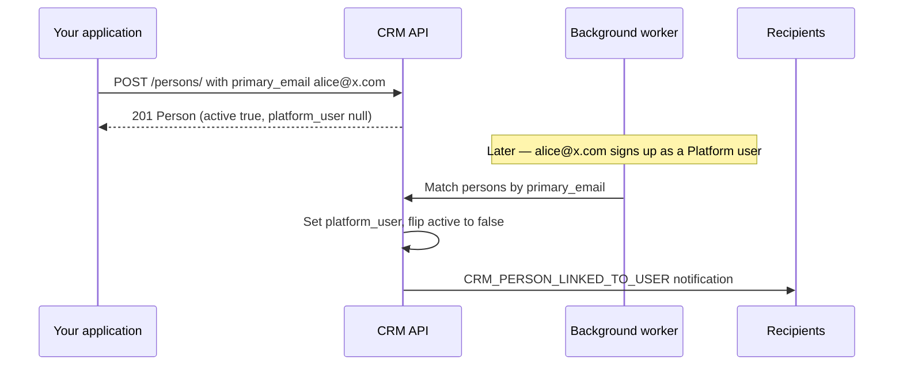
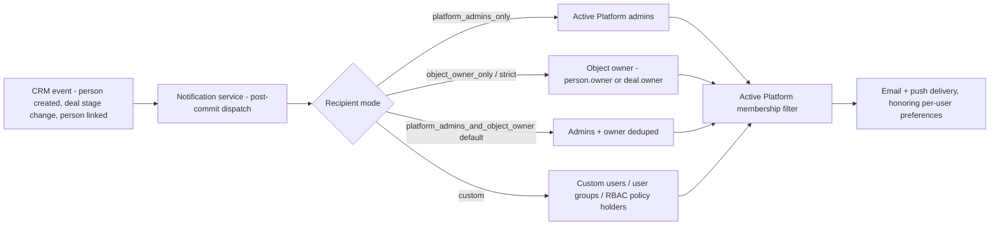

# CRM — workflows & lifecycles

> Doc-sourced explanatory material complementing the verified endpoints in **`/iblai-api-crm`** — see [`SKILL.md`](../SKILL.md) and [`schema.md`](schema.md), which stay authoritative for endpoint methods/paths, field schemas, and filters. Curl examples use the skill convention (`https://api.iblai.app/dm/api/crm/...`, header `Authorization: Api-Token $IBLAI_API_KEY`); "org" denotes the customer workspace, distinct from the CRM **Organization** resource.

## 8. Person Onboarding (Link, Invite, Merge)

People in the CRM start their life as a person record — a row that holds emails, phone numbers, lifecycle stage, ownership, and tags, but is not yet a real account on your org. They become first-class Platform users in one of three ways: by **linking** to a user that already exists, by being **invited** via email, or by being **merged** into another person record when duplicates show up. This section walks through each path, the auto-link signal that ties them together, and the state transitions clients must expect.

### Decision tree

Use this to pick the right endpoint before you call anything:

```mermaid
flowchart TD
    Q{Is there already a Platform user for this person?} -->|Yes, user_id known| L[POST /persons/&#123;id&#125;/link-user/]
    Q -->|No, but the person has an email| I[POST /persons/&#123;id&#125;/invite/]
    Q -->|Duplicate person rows| M[POST /persons/merge/]
```



The three branches are not interchangeable. `link-user` requires a Platform user that already exists; `invite` requires a `primary_email` and produces a Platform user only once the invitee accepts; `merge` is a cleanup operation that re-parents related records and never touches Platform users.

---

### 8.1 Link an existing Platform user

Use this when you already know the Platform user the person corresponds to — for example, you imported a person list and then matched it to your existing user directory.

**Endpoint**

```
POST /api/crm/persons/{id}/link-user/
```

**Request**

```bash
curl -X POST \
  https://api.iblai.app/dm/api/crm/persons/8f0a3c1e-1d52-4a8b-9c2f-1f6e9b2c4d11/link-user/ \
  -H "Authorization: Api-Token $IBLAI_API_KEY" \
  -H "Content-Type: application/json" \
  -d '{"user_id": 4217}'
```

**200 OK** — returns the full person record:

```json
{
  "id": "8f0a3c1e-1d52-4a8b-9c2f-1f6e9b2c4d11",
  "platform": 1,
  "name": "Alice Chen",
  "primary_email": "alice@example.com",
  "platform_user": 4217,
  "active": false,
  "lifecycle_stage": "customer",
  "tags": [],
  "metadata": {},
  "created_at": "2026-05-30T14:02:11Z",
  "updated_at": "2026-06-04T09:18:44Z"
}
```

Note that `active` flips to `false` on a successful link — that is by design. Once a person is bound to a real Platform user, the user record is the source of truth and the person row becomes the historical sales context.

**Silent-refusal callout**

The link service refuses to rebind a person that is already bound to a *different* Platform user. There is no error response — the call returns **200 OK** with the existing binding untouched. Clients **MUST** verify the response body:

```js
if (response.platform_user !== requestedUserId) {
  // Refusal: the person was already linked to someone else.
  // The existing binding is preserved and no audit row is lost.
}
```

This is deliberate — silent rebinds would erase a prior link without trace. If your UI offered a "Link to user" action and you got back a different `platform_user`, surface a "this person is already linked to user X" message rather than claiming success.

**Status codes**

| Status | When |
| --- | --- |
| 200 | Linked, or silent refusal (compare `platform_user` against your request) |
| 400 | Request body missing `user_id` or wrong type |
| 403 | User exists but is not an active member of this org |
| 404 | Person not found in this org, or `user_id` does not exist |

**RBAC**

Requires `Ibl.CRM/Persons/write`. The target user must additionally have an active membership in the same org — otherwise the call returns 403 with the message *"User has no active UserPlatformLink to this platform; issue an invitation instead."*

---

### 8.2 Invite by email

Use this when the person is not yet a Platform user. The invitation reuses the standard org invitation pipeline, and on acceptance a Platform user is created and the auto-link signal (see 8.4) binds the person automatically.

**Endpoint**

```
POST /api/crm/persons/{id}/invite/
```

**Request**

```bash
curl -X POST \
  https://api.iblai.app/dm/api/crm/persons/8f0a3c1e-1d52-4a8b-9c2f-1f6e9b2c4d11/invite/ \
  -H "Authorization: Api-Token $IBLAI_API_KEY" \
  -H "Content-Type: application/json" \
  -d '{
    "redirect_to": "https://app.example.com/dashboard",
    "is_admin": false,
    "is_staff": false
  }'
```

The `is_admin` and `is_staff` flags control what the invitee receives on acceptance — both default to `false`. `redirect_to` is the URL the invitee lands on after accepting; leave it out to use the org default. An optional `enrollment_config` object may also be passed through to auto-enroll the invitee in courses, programs, or pathways on acceptance.

**201 Created**

```json
{
  "person_id": "8f0a3c1e-1d52-4a8b-9c2f-1f6e9b2c4d11",
  "invitation_id": 9821,
  "invitation_email": "alice@example.com",
  "platform_key": "acme",
  "auto_accept": true,
  "active": true,
  "redirect_to": "https://app.example.com/dashboard",
  "created": "2026-06-04T09:24:01Z"
}
```

The invitation email is dispatched out-of-band; the response confirms the invitation row was created, not that the email landed.

**Status codes**

| Status | When |
| --- | --- |
| 201 | Invitation created and queued for delivery |
| 400 | Person has no `primary_email` — cannot invite |
| 403 | Missing `Ibl.CRM/Invite/action` permission |
| 404 | Person not found in this org |
| 409 | An active invitation already exists for this email — response body includes the pre-existing `invitation_id` |
| 422 | Person is already linked to a Platform user (`platform_user` is set) |

The **409** response is informational, not a hard error — the caller can treat it as "already done, here is the invitation you wanted":

```json
{
  "detail": "Active PlatformInvitation already exists for this email + platform.",
  "invitation_id": 9821,
  "person_id": "8f0a3c1e-1d52-4a8b-9c2f-1f6e9b2c4d11",
  "platform_key": "acme"
}
```

**RBAC**

Requires `Ibl.CRM/Invite/action` — and this is the important part: invite is governed by a **separate RBAC bucket** from person-write. A role that can fully edit and delete people but does not carry `Ibl.CRM/Invite/action` cannot send invitations. This is by design — invitations send email and grant org access, so the privilege is split out from generic record editing.

---

### 8.3 Merge duplicates

Duplicates appear when the same human shows up through two channels — a CSV import plus a webform submission, two integrations pointing at the same address, a marketing list collision. Merge re-parents related records onto a chosen primary and marks the rest inactive.

**Endpoint**

```
POST /api/crm/persons/merge/
```

**Request**

```bash
curl -X POST \
  https://api.iblai.app/dm/api/crm/persons/merge/ \
  -H "Authorization: Api-Token $IBLAI_API_KEY" \
  -H "Content-Type: application/json" \
  -d '{
    "primary_id": "8f0a3c1e-1d52-4a8b-9c2f-1f6e9b2c4d11",
    "duplicate_ids": [
      "2b41fa07-77a4-4f0c-8a13-9d6f7e2c4b88",
      "c7e91002-3aa1-4d2e-bff4-1e0d8a4f9a23"
    ]
  }'
```

**200 OK**

```json
{
  "primary_id": "8f0a3c1e-1d52-4a8b-9c2f-1f6e9b2c4d11",
  "merged_ids": [
    "2b41fa07-77a4-4f0c-8a13-9d6f7e2c4b88",
    "c7e91002-3aa1-4d2e-bff4-1e0d8a4f9a23"
  ],
  "reparented": {
    "deals": 7,
    "activities": 23,
    "tags": 4
  }
}
```

**What re-parents**

Inside a single transaction, three relations are moved from each duplicate onto the primary:

- **Deals** — every deal that pointed at a duplicate now points at the primary.
- **Activities** — calls, meetings, tasks, notes attached to a duplicate are re-attached.
- **Tag assignments** — moved across, with one wrinkle: if the primary already carries the same tag, the duplicate's assignment is **dropped silently** (the `(tag, person)` unique constraint forbids stacking). The `tags` count in `reparented` reflects every assignment **touched** — both moves and drops — not just successful moves. If you need to know exactly how many tags landed on the primary, compare before/after listings rather than reading the count.

**What happens to duplicates**

Duplicates are **not** deleted. Each duplicate's `active` flag is set to `false` and the row remains retrievable by id. This preserves audit trail and lets you investigate later — but it also means a `GET /persons/{duplicate_id}/` after a merge returns the inactive row, not a 404. Filter on `active=true` if your UI should hide them.

**Status codes**

| Status | When |
| --- | --- |
| 200 | Merge complete (or no-op rerun) |
| 400 | `primary_id` appears in `duplicate_ids`, or a duplicate belongs to another org, or `duplicate_ids` is empty |
| 403 | Missing `Ibl.CRM/Persons/write` |
| 404 | Primary not found in this org |

**RBAC**

Requires `Ibl.CRM/Persons/write`. Cross-org merges are explicitly forbidden — every id must resolve to a person on the caller's org.

---

### 8.4 Auto-Link Flow

The three actions above are explicit calls a CRM operator makes. There is also a fourth, implicit path: when a Platform user is created — through signup, invitation acceptance, or admin action — the system asynchronously walks the CRM and binds any matching person records automatically. This lets you bulk-import persons before invitations are sent; matching records bind automatically as the invitees register.

**How matching works**

After a Platform user is created with an active membership for an org, the system searches that org for person rows where:

- `primary_email` equals the new user's email (case-insensitive), **or** `platform_user` is already set to that user,
- `active` is `true`,
- the person belongs to an org the user is an active member of.

For every match, the link service runs: `platform_user` is set, `active` is flipped to `false`, and a `CRM_PERSON_LINKED_TO_USER` notification is dispatched for the configured recipients.

The match is gated by org membership — a new user with email `alice@example.com` only auto-links to person rows on orgs they actually belong to. Cross-org leakage is not possible through this path.

**Sequence**



**State transition callout**

The auto-link runs in the background, so the response that created the Platform user returns **before** the link completes. Two consequences for clients:

- A `GET /persons/{id}/` issued moments after a signup may still show `active: true` and `platform_user: null`. A retry seconds later will show the linked state. Build polling or websocket-driven refresh into any UI that surfaces this.
- A person can flip from `active: true` to `active: false` between page loads, with no operator action in between. UIs that render a list of "active people" must tolerate rows disappearing on the next fetch; never crash on the transition.

**Edge cases**

- A user with no email is **skipped** — the system will not bulk-link every blank-`primary_email` person to a fresh emailless user.
- A user with no active org memberships is **skipped** — no orgs to scan.
- A person already bound to a different Platform user is **left alone** (the silent-refusal rule from 8.1 applies here too).
- Re-running auto-link for the same user is a no-op once everything is bound; it is safe to retry on background-task failures.

---
## 9. Deal Lifecycle

A Deal moves through the stages of its Pipeline and reports a high-level `status` of `open`, `won`, or `lost`. Both `status` and `closed_at` are derived from the stage the Deal currently sits in — they are never written directly. Anything that needs to change where a Deal lives in the pipeline goes through one of three action endpoints, and each one writes an audit row and fires a notification so the timeline and the inbox stay in sync with the kanban.

This section is the contract for that flow: which endpoints to call, which fields are off-limits to PATCH, what the audit row looks like, what happens under concurrency, and what counts as a no-op.

### 9.1 The three transitions

There are exactly three endpoints that change a Deal's stage. Everything else — list, retrieve, create, partial update of metadata — leaves the stage alone.

- `POST /api/crm/deals/{id}/move-stage/`
  - Body: `{"stage_id": <int>}` OR `{"stage_code": "<slug>"}`
  - Moves the Deal to any stage in its Pipeline (initial, intermediate, or terminal).
  - Use this for kanban drag-and-drop and for explicit stage pickers.
- `POST /api/crm/deals/{id}/won/`
  - Body (optional): `{"stage_code": "<slug>"}`
  - Moves the Deal to a terminal won stage. If `stage_code` is omitted, the API resolves the first stage in the Pipeline with `is_won: true`, ordered by `sort_order`.
  - Use this for the "Mark as Won" button on a Deal detail page.
- `POST /api/crm/deals/{id}/lost/`
  - Body: `{"lost_reason": "<string>", "stage_code": "<slug>?"}`
  - `lost_reason` is REQUIRED — the API returns 400 if it is missing or blank. `stage_code` is optional and falls back to the first terminal lost stage by `sort_order`.
  - Use this for the "Mark as Lost" modal, which should always collect a reason before submitting.

All three return the updated Deal on success and the standard error envelope on failure.

### 9.2 Read-only fields

`status` and `closed_at` are server-managed and cannot be set by the client.

- A PATCH or PUT against `/api/crm/deals/{id}/` that includes `status` or `closed_at` returns `400` with a field-level error message naming the offending field.
- The fix is to call one of the three action endpoints above. Do not surface `status` or `closed_at` in a Deal edit form; they belong on the transition controls.

`stage` is also not directly writable on update — to change the stage, call `move-stage/`, `won/`, or `lost/`. Direct stage assignment is reserved for Deal creation.

### 9.3 Audit trail

Every successful stage move that actually changes the Deal's stage writes a system Activity. No-ops (Section 9.6) do not.

The audit Activity is shaped like this:

- `type`: `note`
- `is_done`: `true`, with `done_at` stamped to the transition time
- `title`: `"Stage changed"`
- `comment`: `"<From Display Name> → <To Display Name>"` — uses the human-readable stage names, not slugs (for example, `"Negotiation → Closed Won"`, not `"negotiation → closed-won"`).
- `owner`: the user who triggered the transition (the authenticated caller; null for service-account callers without an underlying user).
- `deal`: the Deal that moved.
- `person`: the Deal's `person`, so the audit row also surfaces in person-centric timelines.

Listing activities filtered by `?deal={id}` returns these system rows interleaved with user-logged Activities (calls, meetings, tasks, notes). To make the timeline readable:

- Render system stage-change rows with a distinct icon (an arrow or pipeline glyph works well) and a muted background.
- Do not show edit or "mark done" controls on them — they are already `is_done: true` and they describe an event, not a task.
- Keep them in chronological order with the rest of the timeline so reps can read the full story of the Deal in one pass.

### 9.4 Notification

Every successful, non-no-op stage move fires a `CRM_DEAL_STAGE_CHANGED` notification. The notification carries the Deal, the from-stage, the to-stage, and the user who triggered the move. Routing follows the standard CRM `RecipientsConfig` rules — owner, configured admins, or a custom list per org.

See Section 12 for the full context payload, the available channels, and how to wire recipient routing per org.

### 9.5 Concurrency

Stage moves on the same Deal are serialized.

When the API processes any of the three transition endpoints, it acquires a row lock on the Deal before reading its current stage, writing the new one, recording the audit row, and firing the notification. If two requests land at the same time — a kanban drag racing with someone clicking the Won button, or two reps acting on the same Deal — one wins and runs to completion, then the other proceeds against the now-updated state.

The practical consequences:

- Exactly one stage transition is recorded per logical move. You never get two audit rows for what was conceptually one drag.
- Exactly one `CRM_DEAL_STAGE_CHANGED` notification is fired per logical move. Recipients do not get duplicates.
- The losing request still gets a successful response (or a no-op response, if the winner happened to move the Deal to the same stage the loser was targeting).

The UI does not need to coordinate clients. The lock does the work. What the UI should do is refresh the Deal after a successful transition so the displayed stage matches reality, since another user's action may have run in between.

### 9.6 Idempotency

The three transitions are idempotent with respect to the Deal's current stage. Calling them when the Deal is already where you are asking it to go is a no-op:

- `move-stage/` to the current stage: no write, no audit row, no signal, no notification. Returns `200` with the unchanged Deal.
- `won/` on a Deal already in its won stage: no-op. Returns `200`.
- `lost/` on a Deal already in its lost stage: the stage transition is a no-op (no audit row, no signal, no notification), **but `lost_reason` is overwritten unconditionally with whatever value is in the request body**. Pass the original reason on retries, or PATCH the Deal directly if you want to change only the reason without re-firing the lost action.

This means clients can safely retry transition requests on transient network failures without worrying about double-recording the move.

### 9.7 Re-opening a Deal

Won and lost are not one-way doors. Moving a Deal in a terminal stage back to a non-terminal stage re-opens it:

- `status` flips back to `open`.
- `closed_at` is cleared.
- An audit Activity is still written (`"Closed Won → Negotiation"`, for example).
- A `CRM_DEAL_STAGE_CHANGED` notification still fires, so the owner and configured admins know the Deal is live again.

Use `move-stage/` to re-open. There is no dedicated "reopen" endpoint — the stage move IS the reopen, and the derived `status` follows the destination stage's `is_won` / `is_lost` flags.

### 9.8 Diagram — winning a deal

```mermaid
sequenceDiagram
    participant C as Client
    participant API as CRM API
    participant Recipients as Notification recipients
    C->>API: POST /deals/&#123;id&#125;/won/
    API->>API: Resolve target stage (first is_won)
    API->>API: Lock deal row
    API->>API: Update stage + status + closed_at
    API->>API: Write audit Activity ("Stage changed: Negotiation → Closed Won")
    API->>Recipients: CRM_DEAL_STAGE_CHANGED notification
    API-->>C: 200 Deal (status: won, closed_at set)
```



---
## 10. Activity Timeline & Auto-Records

Activities are the chronological feed for a deal or a person. Calls, meetings, notes, tasks, emails — anything you want logged ends up here. Some rows are user-authored (a sales rep writing a call note), others are written by the server itself when a deal moves through the pipeline. The same endpoint serves both, and the client is responsible for telling them apart.

### 10.1 Reading a timeline

The list endpoint is filterable by either parent. For a deal-centric feed:

```bash
curl -X GET "https://api.iblai.app/dm/api/crm/activities/?deal=314" \
  -H "Authorization: Api-Token $IBLAI_API_KEY"
```

For a person-centric feed:

```bash
curl -X GET "https://api.iblai.app/dm/api/crm/activities/?person=9c6f4a2e-1b88-4a0e-9b71-2c2f7a1d6e44" \
  -H "Authorization: Api-Token $IBLAI_API_KEY"
```

Both calls return the standard paginated envelope. Default order is newest-first by `created_at`.

```json
{
  "count": 1,
  "next_page": null,
  "previous_page": null,
  "results": [
    {
      "id": 8821,
      "platform": 1,
      "type": "call",
      "title": "Discovery call with procurement lead",
      "location": "Zoom",
      "comment": "Walked through pricing tiers and the pilot timeline.",
      "deal": 314,
      "person": "9c6f4a2e-1b88-4a0e-9b71-2c2f7a1d6e44",
      "owner": 42,
      "schedule_from": "2026-06-04T15:00:00Z",
      "schedule_to": "2026-06-04T15:30:00Z",
      "reminder_at": "2026-06-04T14:45:00Z",
      "reminder_sent": false,
      "is_done": true,
      "done_at": "2026-06-04T15:33:11Z",
      "metadata": {"call_outcome": "positive"},
      "created_at": "2026-06-03T09:12:00Z",
      "updated_at": "2026-06-04T15:33:11Z"
    }
  ]
}
```

You can combine filters — `?deal=314&type=call&is_done=false` to render an upcoming-calls panel on a deal page, for example.

### 10.2 Distinguishing system rows from user rows

The CRM writes its own Activities when a deal transitions between stages (see Section 9). These appear in the same feed as user-authored entries, but you usually want to render them with a distinct affordance — a small system icon, no edit button, no mark-done control. There is no dedicated `source` field on the model; distinguish them client-side with a simple predicate:

```ts
const isStageChangeAudit = (a: Activity): boolean =>
  a.type === 'note' && a.title === 'Stage changed';
```

System rows arrive already completed (`is_done: true`, `done_at` set to the transition timestamp). Do not offer edit or done controls for them — the user did not author the row and there is nothing to mark done.

### 10.3 Marking an activity done

```bash
curl -X POST "https://api.iblai.app/dm/api/crm/activities/8821/done/" \
  -H "Authorization: Api-Token $IBLAI_API_KEY"
```

No request body. The action is idempotent: the first call flips `is_done` to `true` and stamps `done_at` with the current server time. Subsequent calls return the same activity with the ORIGINAL `done_at` preserved — the server does not re-stamp on repeat invocations. This matters for offline-capable clients that may retry the same request after a network blip; you will not see the completion time drift forward each time the queue flushes.

The response is the full updated Activity object, so the client can replace the row in its local store without a follow-up GET.

### 10.4 Schedule semantics

The two scheduling fields combine to express three different intents. Pick the shape that matches what you are recording — do not invent dates to satisfy both fields.

| `schedule_from` | `schedule_to` | Read as |
|---|---|---|
| null | null | A past log entry — what happened, recorded after the fact |
| set | null | A scheduled task with a start time but no fixed end |
| set | set | A meeting or time-bounded event |

A call note written ten minutes after the call ended is the first shape. A "follow up next Tuesday" task is the second. A 30-minute demo on the calendar is the third. The server does not enforce a relationship between these fields beyond storage, so a malformed combination (for example, `schedule_to` before `schedule_from`) is the client's responsibility to prevent.

### 10.5 Reminders

The `reminder_at` field is set by the caller — typically a fixed offset before `schedule_from` (15 minutes before is a common default for meetings). The `reminder_sent` flag is server-managed; do not write to it from the client.

> **Reminder delivery is not currently dispatched server-side.** Set `reminder_at` to track intent and surface a local in-app prompt; the field round-trips correctly. `reminder_sent` will remain `false` until a server-side dispatcher is wired.

### 10.6 Attaching an activity

Every activity must attach to a deal OR a person — or both. Posting an Activity with neither field set returns:

```json
{
  "detail": ["Activity must attach to a `deal` or a `person`."]
}
```

with a 400 status. The serializer raises this before any database write, so a failed create has no side effects.

If both `deal` and `person` are set, the person must be the same person already attached to the deal. A mismatch returns a 400 with a field-level error explaining the constraint — see Section 7.6 for the canonical attachment rules and the rationale for why we enforce this at write time rather than letting the timeline display orphaned rows.

A typical create call for a meeting attached to both:

```bash
curl -X POST "https://api.iblai.app/dm/api/crm/activities/" \
  -H "Authorization: Api-Token $IBLAI_API_KEY" \
  -H "Content-Type: application/json" \
  -d '{
    "type": "meeting",
    "title": "Pricing review",
    "deal": 314,
    "person": "9c6f4a2e-1b88-4a0e-9b71-2c2f7a1d6e44",
    "schedule_from": "2026-06-10T16:00:00Z",
    "schedule_to": "2026-06-10T16:45:00Z",
    "reminder_at": "2026-06-10T15:45:00Z"
  }'
```

The response is the created Activity, ready to splice into the timeline view without a re-fetch.

---
## 11. Tagging

Tags are coloured labels you can attach to people, organizations, and deals. Use them for ad-hoc segmentation — VIP, trial, churn-risk, newsletter-2026, whatever the sales team needs this quarter — without inventing custom fields or migrating schema. A tag is just a `(name, color)` pair scoped to your org; attaching it to a host is a cheap join row, and detaching it leaves the host untouched.

### 11.1 Tag CRUD

Full reference for the tag resource itself is in Section 7.7. The short version:

```bash
curl -X POST https://api.iblai.app/dm/api/crm/tags/ \
  -H "Authorization: Api-Token $IBLAI_API_KEY" \
  -H "Content-Type: application/json" \
  -d '{"name": "VIP", "color": "#3F6BFF"}'
```

Two rules to know up front:

- **Names are unique per org.** Comparison is case-sensitive and whitespace is trimmed before the uniqueness check, so `"VIP"` and `" VIP "` collide but `"VIP"` and `"vip"` do not.
- **Colors must match `^#[0-9a-fA-F]{6}$`.** Three-digit shorthand (`#abc`) is rejected. If you omit `color`, the server stores `#888888`.

Violations come back as a 400 with the usual field-error envelope; let the user fix the input and retry.

### 11.2 Attach a tag to a host

To attach an existing tag to a person, organization, or deal:

```
POST /api/crm/{host}/{id}/tags/
```

`{host}` is one of `persons`, `organizations`, `deals`. The body is the tag ID you want to attach:

```bash
curl -X POST https://api.iblai.app/dm/api/crm/persons/42/tags/ \
  -H "Authorization: Api-Token $IBLAI_API_KEY" \
  -H "Content-Type: application/json" \
  -d '{"tag_id": 7}'
```

On success you get `201 Created` with the new assignment plus the embedded tag, so the client never needs a second round trip to render the chip:

```json
{
  "assignment_id": 318,
  "tag": {
    "id": 7,
    "name": "VIP",
    "color": "#3F6BFF"
  }
}
```

Two edge cases worth wiring into the UI:

- **Already attached.** The server returns `409 Conflict` with the exact same shape, where `assignment_id` is the *existing* row. Treat 409 as a no-op success — the user clicked twice or two tabs raced; either way the desired state is already in place. Do not show a red error toast for this case.
- **Tag from another org.** The server returns `404 Not Found`. Existence across orgs is never leaked, so a 404 here means either the tag does not exist or it does not belong to you. Same UX: "Tag not found."

### 11.3 Detach a tag from a host

```
DELETE /api/crm/{host}/{id}/tags/{tag_id}/
```

```bash
curl -X DELETE https://api.iblai.app/dm/api/crm/persons/42/tags/7/ \
  -H "Authorization: Api-Token $IBLAI_API_KEY"
```

Returns `204 No Content` on success with no body. Returns `404 Not Found` (`{"detail": "Tag not attached to this record."}`) if the tag was never attached to that host (or the tag/host does not exist or is not on your org — again, no existence leak across orgs).

**Detach is not idempotent on the server** — the second `DELETE` against an already-detached pair returns `404`, not `204`. From the user's point of view, however, both responses mean the tag is gone, so client code can treat 204 and 404 as the same success state when reconciling local state.

### 11.4 Reading tags off a host

Person, Organization, and Deal serializers expose a read-only `tags` array on every list and detail response. You do not need a separate call to render tag chips on a card or row:

```json
"tags": [
  {"id": 7, "name": "VIP", "color": "#3F6BFF"},
  {"id": 12, "name": "trial", "color": "#22AA66"}
]
```

The array is always present on the response. An empty array means the host has no tags attached — it never comes back as `null` or missing, so your renderer can iterate unconditionally.

### 11.5 Filtering by tag

All three host list endpoints accept a `tags` filter with **OR** semantics. Two equivalent forms are supported:

```
GET /api/crm/persons/?tags=7&tags=12
GET /api/crm/persons/?tags=7,12
```

Both queries return every person tagged with `7` *or* `12`. A person carrying both tags appears once — the backend de-duplicates, so you do not need a `DISTINCT` step on your end.

The `tags` filter composes with every other filter on the list endpoint. For example, "VIP people in the `customer` lifecycle stage owned by user 4":

```
GET /api/crm/persons/?tags=7&lifecycle_stage=customer&owner=4
```

Responses use the standard pagination envelope `{count, next_page, previous_page, results}` where `count`, `next_page`, and `previous_page` are integers (`next_page` / `previous_page` are `null` at the ends).

### 11.6 Permission callout

Attach and detach are gated by a **separate RBAC bucket** from the host itself. The action checks `Ibl.CRM/Tags/write` on the calling role — *not* `Ibl.CRM/Persons/write`, `Ibl.CRM/Organizations/write`, or `Ibl.CRM/Deals/write`.

In practice this means a role can be allowed to edit people but forbidden from tagging them, or the other way around. When deciding whether to render the "Add tag" affordance on a person/organization/deal card, check the tag-write permission independently of the host-write permission. The most common UX bug here is hiding the tag chooser behind the host's edit gate — which silently locks tag-write users out of a feature they actually have.

### 11.7 Destructive cascade callout

> **Deleting a tag silently removes it from every person, organization, and deal it is attached to.** There is no preview endpoint that tells you how many hosts will lose the tag, and there is no undo. The assignment rows are hard-deleted along with the tag itself.

Because the blast radius is invisible from the API, the UI has to carry the warning. Gate `DELETE /api/crm/tags/{id}/` behind a strong confirm dialog with copy along these lines:

> *"This will remove the tag from every person, organization, and deal it is attached to. This cannot be undone."*

If you want a softer migration path for your users, build a client-side "archive" convention — e.g. rename the tag to `zz_archived_VIP` and recolor it grey — and reserve true delete for tags you are certain nobody is filtering on.

---
## 12. Notifications

> Cross-ref: notification template, recipient, and channel management endpoints live in **`/iblai-api-notification`**. This section covers only the CRM-specific parts — which events fire, the context keys each template can interpolate, and how recipient routing resolves.

The CRM fires three notification types. Each is configurable per org — you can change recipients, edit the email/push template content, or toggle the type off entirely through the notification templates API. The mechanics (template storage, channel routing, preference resolution) are the same machinery every other notification type in the system uses; cross-reference the notification system documentation for the full template payload and lifecycle. This section covers only what is CRM-specific: when each type fires, the context keys the template can interpolate, and how recipient routing works.

### 12.1 The three types

| Type | Fires when | Context provided to template | Default recipients |
|---|---|---|---|
| `CRM_PERSON_CREATED` | A person is created (API, admin, or import) | `person_id`, `person_name`, `person_email`, `person_lifecycle_stage`, `person_job_title`, `owner_username` | org admins + person owner |
| `CRM_DEAL_STAGE_CHANGED` | A deal moves between stages (`move-stage` / `won` / `lost`). No-op transitions (same stage to same stage) are suppressed. | `deal_id`, `deal_title`, `deal_status`, `deal_lead_value`, `deal_currency`, `from_stage_code`, `from_stage_name`, `to_stage_code`, `to_stage_name`, `person_name`, `actor_username` | org admins + deal owner |
| `CRM_PERSON_LINKED_TO_USER` | A person is bound to a Platform user — either by the auto-link signal that matches on email when a new user registers, or by an explicit call to `/link-user/` | `person_id`, `person_name`, `person_email`, `linked_user_id`, `linked_user_username`, `linked_user_email` | org admins + person owner |

All three are dispatched asynchronously after the writing transaction commits. If the write that triggered the signal is rolled back — a validation failure further down the request, a `move-stage` call that raises mid-transition — no notification is produced. The signal is observed, but the dispatch only fires on the post-commit hook, so consumers never see ghost notifications for state that never persisted.

Context keys are populated at signal time from the live object. A template that references `{{ deal_lead_value }}` reads the value as it stood the moment the stage transition committed; later edits to the deal do not re-render or re-send the notification.

### 12.2 Recipient modes

Every CRM notification template — and in fact any notification type that opts into the shared recipients pipeline — can be configured per org with one of five recipient modes:

| Mode | Effect |
|---|---|
| `platform_admins_only` | Deliver only to active org admins. The object's owner is ignored. |
| `object_owner_only` | Deliver to the object's owner. If the owner field is unset, fall back to org admins so the notification is not silently dropped. |
| `object_owner_only_strict` | Deliver to the object's owner only. If the owner is unset, no one is notified. Use when the notification is meaningless without an owner. |
| `platform_admins_and_object_owner` | Default. Both audiences receive the notification, deduplicated so an admin who is also the owner does not get two copies. |
| `custom` | Deliver to a hand-picked list of users, user groups, or RBAC role-policy holders. Admins and the owner are not implicitly included. |

"Object owner" refers to the `owner` field on the triggering object:

- For `CRM_PERSON_CREATED` and `CRM_PERSON_LINKED_TO_USER`, that is `person.owner`.
- For `CRM_DEAL_STAGE_CHANGED`, that is `deal.owner`.

If an object is created without an owner — for instance, an imported person row that has no assigned account manager yet — the fallback behavior described in the table applies. There is no separate concept of an organization-level owner being used for routing.

### 12.3 Custom recipient shape

When the mode is `custom`, the template's `recipients_custom_recipients` field holds a list. Each entry takes one of three shapes:

```json
{"type": "user", "id": 123}
```

```json
{"type": "user_group", "id": 7}
```

```json
{"type": "rbac_policy", "policy_name": "CRM Manager"}
```

The three types compose freely — a single custom list can mix individual users, groups, and policy holders. The resolver expands each entry, unions the results, deduplicates, and then runs the active-org-membership filter described below.

Custom recipients are re-filtered against active org membership at delivery time. A stale entry — a user who has left the org, a group whose roster has changed, a policy that has been reassigned — simply contributes no one to that send. You do not need to prune the list manually when membership changes; the resolver does it on every dispatch. This means a single custom recipient list can be maintained centrally even if individual users come and go.

If every entry in a custom list resolves to zero active members, the notification produces no deliveries for that org on that event. It is not auto-promoted back to the default mode; "no recipients" is treated as a valid configured outcome.

### 12.4 Changing recipients

Recipient configuration lives on the notification template, not on the CRM models. To change who hears about, say, deal stage transitions on a given org, PATCH the template for `CRM_DEAL_STAGE_CHANGED` on that org via the notification templates API and set:

- `recipients_recipient_mode` — one of the five modes from 12.2.
- `recipients_custom_recipients` — required when the mode is `custom`; a list of target dicts as shown in 12.3. Ignored for the other modes.

The exact endpoint path, full payload schema, and authentication requirements are documented under the notification system. The CRM does not add a separate API surface for this — the same template management endpoints that handle every other notification type handle these three.

Toggling a type off entirely is also done at the template level via the standard enable/disable flag on the notification template. The CRM signal still fires; the callback short-circuits before resolving recipients or dispatching. There is no CRM-side setting to suppress notifications.

### 12.5 Channels

Email delivery is wired by default for all three CRM notifications. Whether a given recipient actually receives mail depends on their individual notification preferences, which are honored by the underlying delivery machinery — the CRM does not bypass user preferences.

Additional channels (in-app feed, push notification) follow the template's channel configuration if added there; the CRM callbacks themselves dispatch email. Consult the templates API to inspect or change the active channel set per type, the same way you change recipients.

### 12.6 Diagram — notification routing



The membership filter is the last gate before delivery. Every resolved recipient — regardless of mode — is checked against the org's active membership at dispatch time. A user who has been removed from the org between the event and the dispatch does not receive the notification, even if they appear in a custom list, were the recorded `owner`, or were an admin at the time the event fired.

---
