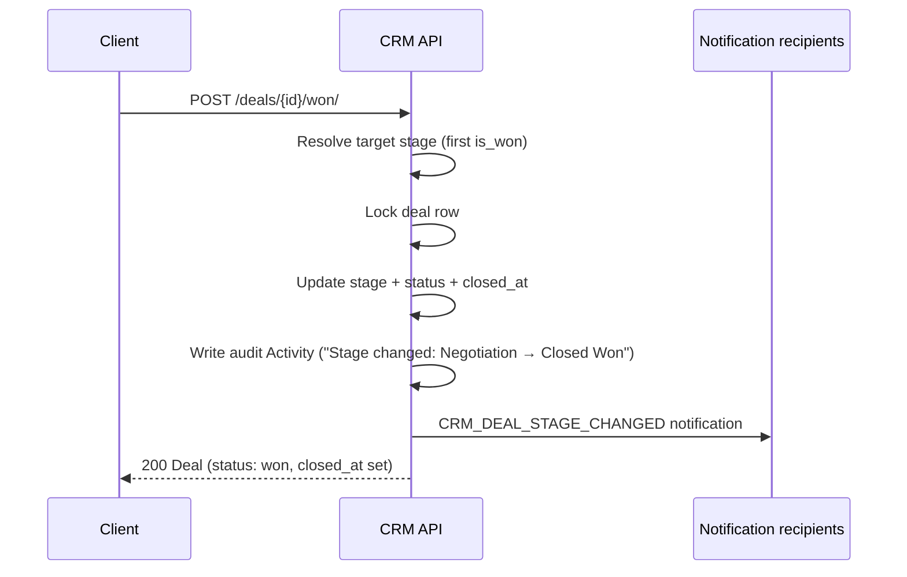

# Deal Lifecycle — State Machine

Full text of the CRM doc [Deal Lifecycle](../../../../docs/developer/applications/crm.md#9-deal-lifecycle).

A Deal moves through the stages of its Pipeline and reports a high-level
`status` of `open`, `won`, or `lost`. Both `status` and `closed_at` are
**derived** from the stage the Deal currently sits in — they are never
written directly. Anything that needs to change where a Deal lives in the
pipeline goes through one of three action endpoints, and each one writes
an audit row and fires a notification so the timeline and the inbox stay
in sync with the kanban.

This is the contract for that flow: which endpoints to call, which fields
are off-limits to PATCH, what the audit row looks like, what happens under
concurrency, and what counts as a no-op.

## 1. The three transitions

There are exactly three endpoints that change a Deal's stage. Everything
else — list, retrieve, create, partial update of metadata — leaves the
stage alone.

### `POST /api/crm/deals/{id}/move-stage/`

- Body: `{"stage_id": <int>}` OR `{"stage_code": "<slug>"}`
- Moves the Deal to any stage in its Pipeline (initial, intermediate, or
  terminal).
- Use this for kanban drag-and-drop and for explicit stage pickers.

### `POST /api/crm/deals/{id}/won/`

- Body (optional): `{"stage_code": "<slug>"}`
- Moves the Deal to a terminal won stage. If `stage_code` is omitted, the
  API resolves the first stage in the Pipeline with `is_won: true`, ordered
  by `sort_order`.
- Use this for the "Mark as Won" button on a Deal detail page.

### `POST /api/crm/deals/{id}/lost/`

- Body: `{"lost_reason": "<string>", "stage_code": "<slug>?"}`
- `lost_reason` is **REQUIRED** — the API returns 400 if it is missing or
  blank. `stage_code` is optional and falls back to the first terminal
  lost stage by `sort_order`.
- Use this for the "Mark as Lost" modal, which should always collect a
  reason before submitting.

All three return the updated Deal on success and the standard error
envelope on failure.

## 2. Read-only fields

`status` and `closed_at` are server-managed and cannot be set by the client.

- A PATCH or PUT against `/api/crm/deals/{id}/` that includes `status` or
  `closed_at` returns `400` with a field-level error message naming the
  offending field.
- The fix is to call one of the three action endpoints above. Do not
  surface `status` or `closed_at` in a Deal edit form; they belong on the
  transition controls.

`stage` is also not directly writable on update — to change the stage,
call `move-stage/`, `won/`, or `lost/`. Direct stage assignment is reserved
for Deal creation.

## 3. Audit trail

Every successful stage move that actually changes the Deal's stage writes
a system Activity. No-ops (see [Idempotency](#6-idempotency)) do not.

The audit Activity is shaped like this:

| Field | Value |
|---|---|
| `type` | `note` |
| `is_done` | `true` |
| `done_at` | transition time |
| `title` | `"Stage changed"` |
| `comment` | `"<From Display Name> → <To Display Name>"` — uses the human-readable stage names, not slugs (for example `"Negotiation → Closed Won"`, not `"negotiation → closed-won"`) |
| `owner` | the user who triggered the transition (the authenticated caller; null for service-account callers without an underlying user) |
| `deal` | the Deal that moved |
| `person` | the Deal's `person`, so the audit row also surfaces in person-centric timelines |

Listing activities filtered by `?deal={id}` returns these system rows
interleaved with user-logged Activities (calls, meetings, tasks, notes).
To make the timeline readable:

- Render system stage-change rows with a distinct icon (an arrow or
  pipeline glyph works well) and a muted background.
- Do not show edit or "mark done" controls on them — they are already
  `is_done: true` and they describe an event, not a task.
- Keep them in chronological order with the rest of the timeline so reps
  can read the full story of the Deal in one pass.

See `/iblai-crm-activity` for the full timeline rendering contract.

## 4. Notification

Every successful, non-no-op stage move fires a `CRM_DEAL_STAGE_CHANGED`
notification. The notification carries the Deal, the from-stage, the
to-stage, and the user who triggered the move. Routing follows the
standard CRM `RecipientsConfig` rules — owner, configured admins, or a
custom list per Platform.

See `/iblai-crm-notification` for the full context payload, the available
channels, and how to wire recipient routing per Platform.

## 5. Concurrency

Stage moves on the same Deal are serialized.

When the API processes any of the three transition endpoints, it acquires
a row lock on the Deal before reading its current stage, writing the new
one, recording the audit row, and firing the notification. If two requests
land at the same time — a kanban drag racing with someone clicking the
Won button, or two reps acting on the same Deal — one wins and runs to
completion, then the other proceeds against the now-updated state.

The practical consequences:

- Exactly one stage transition is recorded per logical move. You never
  get two audit rows for what was conceptually one drag.
- Exactly one `CRM_DEAL_STAGE_CHANGED` notification is fired per logical
  move. Recipients do not get duplicates.
- The losing request still gets a successful response (or a no-op
  response, if the winner happened to move the Deal to the same stage the
  loser was targeting).

The UI does not need to coordinate clients. The lock does the work. What
the UI should do is **refresh the Deal after a successful transition** so
the displayed stage matches reality, since another user's action may have
run in between.

## 6. Idempotency

The three transitions are idempotent with respect to the Deal's current
stage. Calling them when the Deal is already where you are asking it to
go is a no-op:

- `move-stage/` to the current stage: no write, no audit row, no signal,
  no notification. Returns `200` with the unchanged Deal.
- `won/` on a Deal already in its won stage: no-op. Returns `200`.
- `lost/` on a Deal already in its lost stage: the stage transition is a
  no-op (no audit row, no signal, no notification), **but `lost_reason`
  is overwritten unconditionally with whatever value is in the request
  body**. Pass the original reason on retries, or PATCH the Deal directly
  if you want to change only the reason without re-firing the lost action.

This means clients can safely retry transition requests on transient
network failures without worrying about double-recording the move.

## 7. Re-opening a Deal

Won and lost are not one-way doors. Moving a Deal in a terminal stage
back to a non-terminal stage re-opens it:

- `status` flips back to `open`.
- `closed_at` is cleared.
- An audit Activity is still written (`"Closed Won → Negotiation"`, for
  example).
- A `CRM_DEAL_STAGE_CHANGED` notification still fires, so the owner and
  configured admins know the Deal is live again.

Use `move-stage/` to re-open. There is no dedicated "reopen" endpoint —
the stage move IS the reopen, and the derived `status` follows the
destination stage's `is_won` / `is_lost` flags.

## 8. Diagram — winning a deal



## State diagram — derived status

```
                  move-stage(non-terminal)
                 ┌───────────────────────────────┐
                 │                               ▼
            ┌────────┐   move-stage(is_won)   ┌────────┐
            │  open  │ ─────── won/ ────────► │  won   │
            └────────┘                        └────────┘
                 │                               │
                 │ move-stage(is_lost)           │ move-stage(non-terminal) → re-open
                 │      lost/                    ▼
                 │                          ┌────────┐
                 └────────────────────────► │  lost  │
                                            └────────┘
                                                │
                                                │ move-stage(non-terminal) → re-open
                                                ▼
                                            (back to open)
```

Every arrow above (except no-op self-loops) writes one audit Activity
and fires one `CRM_DEAL_STAGE_CHANGED` notification.
