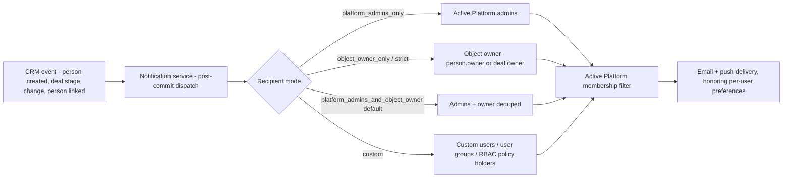

# CRM notification types — reference

Condensed from the ibl.ai CRM developer documentation, [Notifications](../../../../docs/developer/applications/crm.md#12-notifications).
Use this file as the lookup table when wiring inbox filters, configuring
recipient routing on a Platform, or building a custom CRM-only inbox surface.

The CRM fires three notification types. Each is configurable per Platform —
you can change recipients, edit the email/push template content, or toggle
the type off entirely through the notification templates API. The mechanics
(template storage, channel routing, preference resolution) are the same
machinery every other notification type in the system uses; cross-reference
the notification system documentation (`/iblai-notification`) for the full
template payload and lifecycle. This file covers only what is CRM-specific:
when each type fires, the context keys the template can interpolate, and how
recipient routing works.

---

## 1. The three types

| Type | Fires when | Default recipients |
|---|---|---|
| `CRM_PERSON_CREATED` | A person is created (API, admin, or import) | Platform admins + person owner |
| `CRM_DEAL_STAGE_CHANGED` | A deal moves between stages (`move-stage` / `won` / `lost`). No-op transitions (same stage to same stage) are suppressed. | Platform admins + deal owner |
| `CRM_PERSON_LINKED_TO_USER` | A person is bound to a Platform user — either by the auto-link signal that matches on email when a new user registers, or by an explicit call to `/link-user/` | Platform admins + person owner |

### Context keys per type

Every notification carries a `context` object the template interpolates
into the rendered title/body/email. The keys provided for each type:

**`CRM_PERSON_CREATED`**

| Key | Source |
|---|---|
| `person_id` | `person.id` |
| `person_name` | `person.name` |
| `person_email` | `person.email` |
| `person_lifecycle_stage` | `person.lifecycle_stage` |
| `person_job_title` | `person.job_title` |
| `owner_username` | `person.owner.username` |

**`CRM_DEAL_STAGE_CHANGED`**

| Key | Source |
|---|---|
| `deal_id` | `deal.id` |
| `deal_title` | `deal.title` |
| `deal_status` | `deal.status` (`open` / `won` / `lost`) |
| `deal_lead_value` | `deal.lead_value` |
| `deal_currency` | `deal.currency` |
| `from_stage_code` | Source stage's `code` |
| `from_stage_name` | Source stage's display name |
| `to_stage_code` | Destination stage's `code` |
| `to_stage_name` | Destination stage's display name |
| `person_name` | `deal.person.name` |
| `actor_username` | Username of the user that called `move-stage`/`won`/`lost` |

**`CRM_PERSON_LINKED_TO_USER`**

| Key | Source |
|---|---|
| `person_id` | `person.id` |
| `person_name` | `person.name` |
| `person_email` | `person.email` |
| `linked_user_id` | The Platform user's id |
| `linked_user_username` | The Platform user's username |
| `linked_user_email` | The Platform user's email |

### After-commit dispatch rule

All three are dispatched asynchronously **after the writing transaction
commits**. If the write that triggered the signal is rolled back — a
validation failure further down the request, a `move-stage` call that
raises mid-transition — no notification is produced. The signal is
observed, but the dispatch only fires on the post-commit hook, so
consumers never see ghost notifications for state that never persisted.

Context keys are populated at signal time from the live object. A
template that references `{{ deal_lead_value }}` reads the value as it
stood the moment the stage transition committed; later edits to the deal
do not re-render or re-send the notification.

---

## 2. Recipient modes

Every CRM notification template — and in fact any notification type that
opts into the shared recipients pipeline — can be configured per Platform
with one of five recipient modes:

| Mode | Effect |
|---|---|
| `platform_admins_only` | Deliver only to active Platform admins. The object's owner is ignored. |
| `object_owner_only` | Deliver to the object's owner. If the owner field is unset, fall back to Platform admins so the notification is not silently dropped. |
| `object_owner_only_strict` | Deliver to the object's owner only. If the owner is unset, no one is notified. Use when the notification is meaningless without an owner. |
| `platform_admins_and_object_owner` | Default. Both audiences receive the notification, deduplicated so an admin who is also the owner does not get two copies. |
| `custom` | Deliver to a hand-picked list of users, user groups, or RBAC role-policy holders. Admins and the owner are not implicitly included. |

"Object owner" refers to the `owner` field on the triggering object:

- For `CRM_PERSON_CREATED` and `CRM_PERSON_LINKED_TO_USER`, that is `person.owner`.
- For `CRM_DEAL_STAGE_CHANGED`, that is `deal.owner`.

If an object is created without an owner — for instance, an imported
person row that has no assigned account manager yet — the fallback
behavior described in the table applies. There is no separate concept of
an organization-level owner being used for routing.

---

## 3. Custom recipient shape

When the mode is `custom`, the template's `recipients_custom_recipients`
field holds a list. Each entry takes one of three shapes:

```json
{"type": "user", "id": 123}
```

```json
{"type": "user_group", "id": 7}
```

```json
{"type": "rbac_policy", "policy_name": "CRM Manager"}
```

The three types compose freely — a single custom list can mix individual
users, groups, and policy holders. The resolver expands each entry,
unions the results, deduplicates, and then runs the active-Platform-
membership filter described below.

Custom recipients are re-filtered against active Platform membership at
delivery time. A stale entry — a user who has left the Platform, a group
whose roster has changed, a policy that has been reassigned — simply
contributes no one to that send. You do not need to prune the list
manually when membership changes; the resolver does it on every dispatch.
This means a single custom recipient list can be maintained centrally
even if individual users come and go.

If every entry in a custom list resolves to zero active members, the
notification produces no deliveries for that Platform on that event. It
is not auto-promoted back to the default mode; "no recipients" is
treated as a valid configured outcome.

---

## 4. Changing recipients

Recipient configuration lives on the notification template, **not** on
the CRM models. To change who hears about, say, deal stage transitions
on a given Platform, `PATCH` the template for `CRM_DEAL_STAGE_CHANGED`
on that Platform via the notification templates API and set:

- `recipients_recipient_mode` — one of the five modes from section 2.
- `recipients_custom_recipients` — required when the mode is `custom`; a
  list of target dicts as shown in section 3. Ignored for the other modes.

The exact endpoint path, full payload schema, and authentication
requirements are documented under the notification system
(`/iblai-notification`). The CRM does not add a separate API surface for
this — the same template management endpoints that handle every other
notification type handle these three.

Toggling a type off entirely is also done at the template level via the
standard enable/disable flag on the notification template. The CRM
signal still fires; the callback short-circuits before resolving
recipients or dispatching. There is no CRM-side setting to suppress
notifications.

---

## 5. Channels

Email delivery is wired by default for all three CRM notifications.
Whether a given recipient actually receives mail depends on their
individual notification preferences, which are honored by the underlying
delivery machinery — the CRM does not bypass user preferences.

Additional channels (in-app feed, push notification) follow the
template's channel configuration if added there; the CRM callbacks
themselves dispatch email. Consult the templates API
(`/iblai-notification`) to inspect or change the active channel set per
type, the same way you change recipients.

---

## 6. Diagram — notification routing



The membership filter is the last gate before delivery. Every resolved
recipient — regardless of mode — is checked against the Platform's
active membership at dispatch time. A user who has been removed from the
Platform between the event and the dispatch does not receive the
notification, even if they appear in a custom list, were the recorded
`owner`, or were an admin at the time the event fired.

---

## Related references

- Source documentation: [IBL CRM Developer Documentation — Notifications](../../../../docs/developer/applications/crm.md#12-notifications)
- Bell UI + template management API: `/iblai-notification`
- Event sources: `/iblai-crm-lead-flow` (person events), `/iblai-crm-deal-flow` (stage events)
