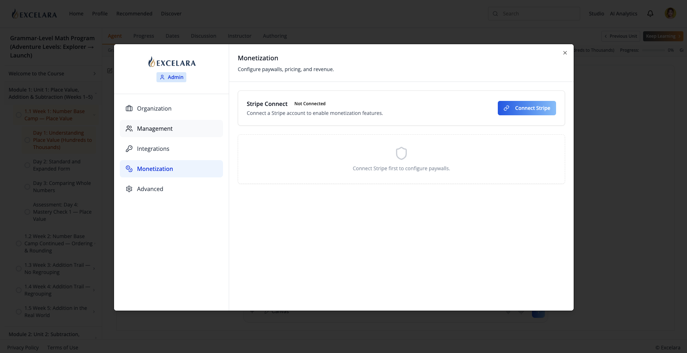
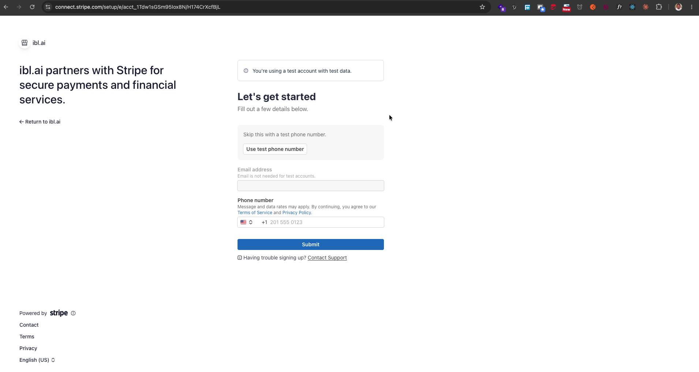
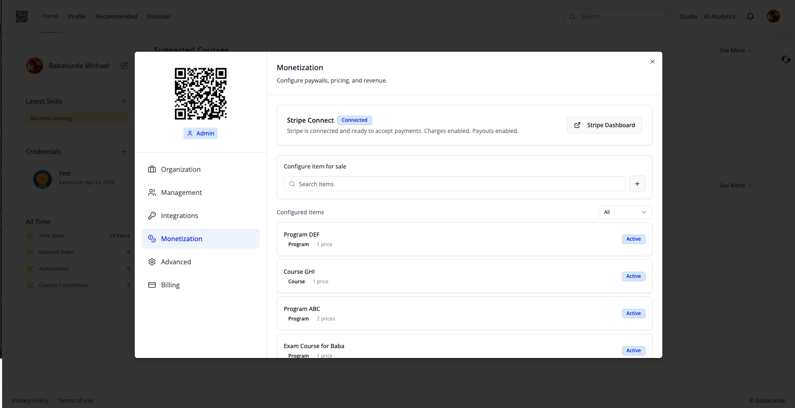
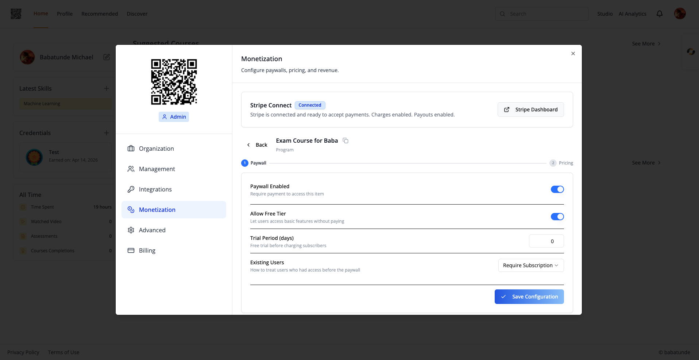
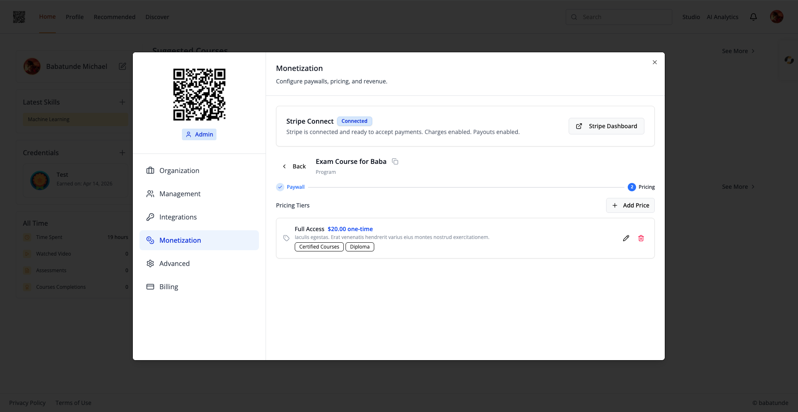
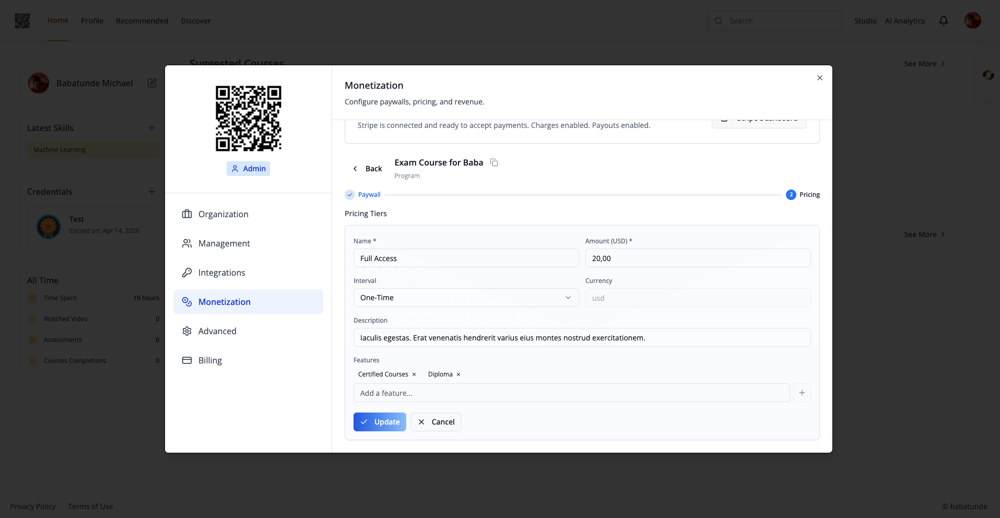

# Monetization — Admin Onboarding

Connect your tenant's Stripe account so you can sell agents, courses,
programs, pathways, or custom items through ibl.ai paywalls.

> **Walkthrough video:** [Loom — Monetization admin onboarding](https://www.loom.com/share/5e6f59144eb449a9b0ae7dd94feff823)
>
> **Stripe reference:** [Stripe Connect onboarding](https://stripe.com/connect/onboarding)

This README covers the **admin-side onboarding flow only** — the
steps a tenant owner takes to wire up Stripe Connect before any
paywall can go live. For the full SDK / component / data-layer
reference (PaywallModal, PurchasesTab, RTK Query hooks, custom items,
grandfathering, etc.) see [SKILL.md](./SKILL.md).

---

## Who this is for

A tenant **admin** (`is_admin === true` on the current tenant) on a
tenant whose `enable_monetization` flag is on. If the Monetization
tab is not visible in your Account sidebar, ask your ibl.ai operator
to enable `enable_monetization` for your tenant — there is no in-app
toggle.

## What you'll end up with

- A Stripe Connect Express account linked to your tenant
- A green **Connected** badge on the Stripe Connect card
- The ability to add paywalls and pricing tiers to any item you sell
- Buyer-facing Stripe Checkout sessions paying directly into your
  Stripe account

---

## Step 1 — Open tenant settings (Account)

From any page in the app:

1. Click your **avatar** in the top-right of the navbar.
2. Choose **Account** from the dropdown (or navigate to `/account`).

The Account modal opens with a left-hand sidebar of tabs:
Organization, Management, Integrations, **Monetization**, Advanced,
Billing.

> If you do not see the **Monetization** entry in the sidebar, the
> `enable_monetization` flag is off for your tenant. Contact your
> ibl.ai operator / customer success contact.

## Step 2 — Open the Monetization tab

Click **Monetization** in the sidebar.

You'll see the tab header (**"Monetization — Configure paywalls,
pricing, and revenue."**) and two sections:

- **Stripe Connect** card at the top
- **Paywall config** area below it (disabled until Stripe is connected)



While Stripe is not connected, the Stripe Connect card shows:

- Status badge: **Not Connected**
- Helper copy: *"Connect a Stripe account to enable monetization features."*
- A blue **Connect Stripe** button on the right

The Paywall config area shows a dashed-border empty state with a
shield icon: *"Connect Stripe first to configure paywalls."* This is
expected — the paywall builder unlocks only after Stripe is ready.

## Step 3 — Click **Connect Stripe**

Click the blue **Connect Stripe** button on the Stripe Connect card.

Under the hood, the SDK calls
`useStartStripeConnectOnboardingMutation` which posts to:

```
POST /api/service/platforms/{platform_key}/stripe/connect/onboard/
```

with the current page as `return_url` / `refresh_url` and
`business_type: 'company'`. The response includes a Stripe-hosted
onboarding URL, and the SDK redirects you to it via
`window.location.href`.

## Step 4 — Fill out the Stripe onboarding form

You'll land on a Stripe-hosted **Connect Express onboarding** page
(see [stripe.com/connect/onboarding](https://stripe.com/connect/onboarding)
for the full spec).



Stripe will ask for:

- **Business details** — legal entity name, business type, country,
  address, tax ID / EIN
- **Representative details** — name, date of birth, home address,
  last 4 of SSN (US) or equivalent (KYC requirement)
- **Bank account** — routing + account number for payouts
- **Verification documents** — government-issued ID and, depending
  on your country / risk tier, additional documents

Have these ready before you start — Stripe's session can time out and
you'll have to restart. Stripe handles all KYC, compliance, and
verification; ibl.ai never sees your bank details or ID documents.

Required fields depend on the country you select. Stripe shows
country-specific forms automatically.

## Step 5 — Return to the Monetization tab

When you finish (or save & exit) Stripe's onboarding, Stripe redirects
back to your app with a `?profileTab=monetization` query parameter on
the Account page. The Account modal re-opens straight to the
Monetization tab so you can verify the result.



The Stripe Connect card now shows:

- Status badge: **Connected** (green)
- Helper copy: *"Stripe is connected and ready to accept payments.
  Charges enabled. Payouts enabled."*
- A **Stripe Dashboard** button (opens your tenant's Stripe Express
  dashboard in a new tab)

The Paywall config area below it is now active:

- **Configure item for sale** — search box to pick an existing
  mentor / course / program, plus a `+` button to create a custom
  item
- **Configured Items** — list of items that already have paywalls,
  with status filter (`All` / `Active` / `Disabled`) and pagination
  (8 per page)

If you only see **Charges enabled** without **Payouts enabled**,
Stripe is still verifying your bank details. Charges will work but
payouts will queue until verification clears (usually 1–2 business
days). The SDK exposes this as `is_ready_for_payments` on the status
response.

## Step 6 — Configure your first paywalled item

1. In **Configure item for sale**, type the name of a mentor, course,
   or program you own. The search dropdown returns matches across
   all three (or click the `+` button for a custom item).
2. Select the item. The wizard opens with a step indicator:
   **Paywall → Pricing** (2 steps for existing items; 3 steps for
   custom items, with an extra **Item Details** step first).

   

3. On the **Paywall** step:
   - **Paywall Enabled** — toggle on to require payment for access.
   - **Allow Free Tier** — let users access basic features without
     paying.
   - **Trial Period (days)** — free trial length before charging.
   - **Existing Users** — grandfathering strategy for users who
     already had access:
     - `Free Forever` — existing users keep free access; new users pay.
     - `Require Subscription` — everyone (existing + new) must
       subscribe.
   - Click **Save Configuration**.
4. On the **Pricing** step, add one or more pricing tiers. Each tier
   has:
   - **Name** (e.g. "Pro", "Monthly", "Lifetime")
   - **Amount** (USD — the SDK currently hardcodes `currency: 'usd'`)
   - **Interval** (`Monthly` / `Yearly` / `One-Time`)
   - **Description** (optional)
   - **Features** — bullet list shown under the price card (chip
     input; press Enter to add each)

   
   

5. After saving the paywall the wizard title gets a **copy** icon
   next to the item name. Click it to copy a shareable buy URL —
   `${authURL}/buy/{paywallUniqueId}` — which you can send to
   prospective buyers or embed in marketing pages.

## Step 7 — Verify the buyer experience

Open the item's URL in an incognito window (or as a non-subscribed
user). You should see `PaywallModal` with your configured pricing
tiers and a gradient blue **Pay** button per tier. Clicking **Pay**
creates a Stripe Checkout session against your connected account and
redirects the buyer to Stripe.

When the buyer completes payment, Stripe redirects them back to your
app, the access check (`useCheckAccessQuery`) returns
`has_access: true`, and the item unlocks.

---

## Where to go next

- **Add a paywall to a custom item** — use the `+` button next to
  the search box and supply your own item type / id / name / product
  URL.
- **Sell to anonymous users** — use `useCreateGuestCheckoutMutation`
  on a public landing page (no auth required; pre-fills the buyer's
  email into Stripe Checkout).
- **Track revenue and subscribers** — wire `useGetRevenueQuery`,
  `useListSubscribersQuery`, and `useListItemSubscribersQuery` into
  your own dashboard.
- **Cancel a subscriber on their behalf** — the
  `CancelSubscription` admin panel inside `MonetizationTab` looks up
  by `(item_type, item_id)` and either cancels immediately or
  returns a Stripe Customer Portal URL.

Full SDK / data-layer / component reference: [SKILL.md](./SKILL.md).

## Troubleshooting

| Symptom | Likely cause | Fix |
|---|---|---|
| **Monetization** tab missing from Account sidebar | `enable_monetization` flag is off for your tenant | Ask your ibl.ai operator to enable it — no in-app toggle |
| **Connect Stripe** button does nothing | `authURL` not passed to `<Account>` | Pass `authURL={config.authUrl()}` — see [SKILL.md](./SKILL.md) Step 4 |
| Returned from Stripe but tab opens on Organization, not Monetization | Router stripped the `?profileTab=monetization` query param | Stop stripping query params on the Account route |
| Status shows **Connected** but Paywall section still disabled | Stripe finished basic onboarding but not payments verification (`is_ready_for_payments === false`) | Open **Stripe Dashboard** and complete the remaining requirements Stripe lists |
| Buyer hits Checkout and Stripe rejects the payment | Onboarded account hasn't passed KYC yet | Wait for Stripe verification (1–2 business days) or supply remaining documents |
| Buyer pays successfully but lands back on the paywall on refresh | Custom buy page set `success_url = window.location.href` | Set `success_url` to a "Thanks" page or the unlocked destination |
| Wizard saves a paywall but Stripe Checkout has no `success_url` | `authURL` missing — `on_successful_payment` silently fell back to `undefined` | Pass `authURL={config.authUrl()}` to `<Account>` |

For the full mistake list (custom items, grandfathering, multi-currency,
402 access checks, etc.) see the **Common mistakes** section of
[SKILL.md](./SKILL.md).
