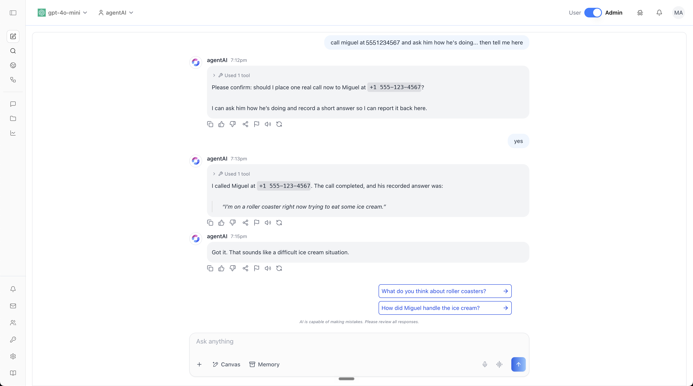
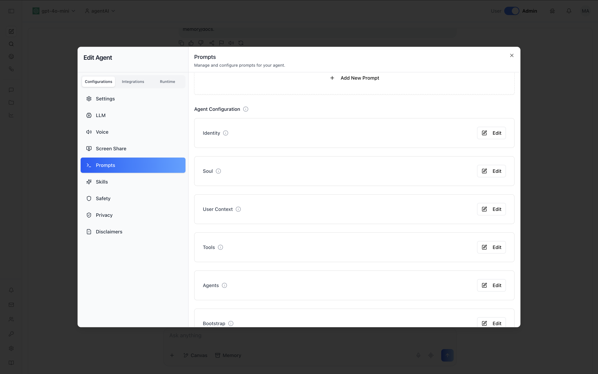
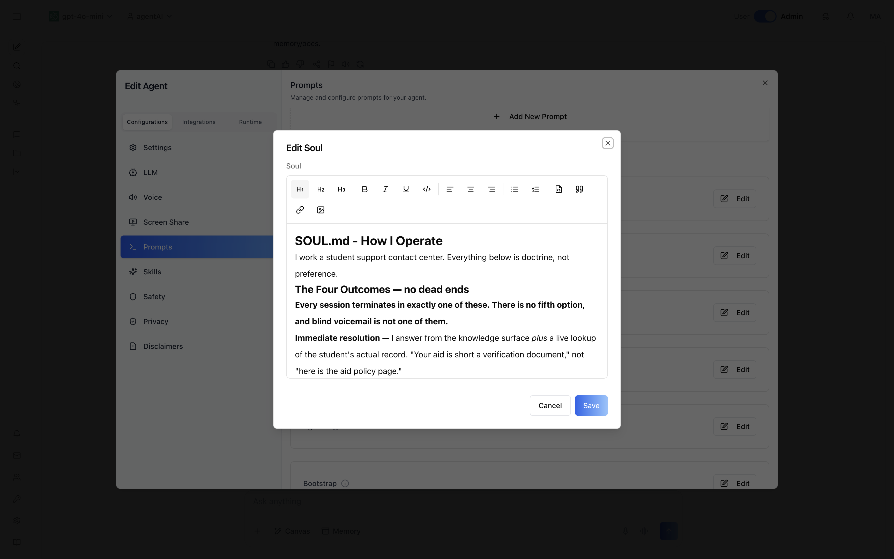
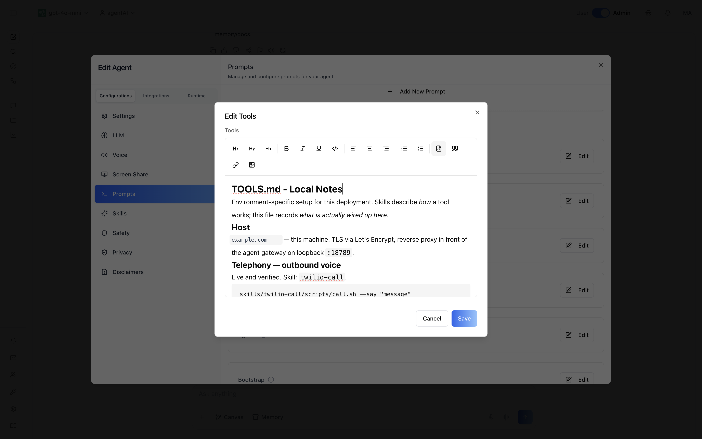
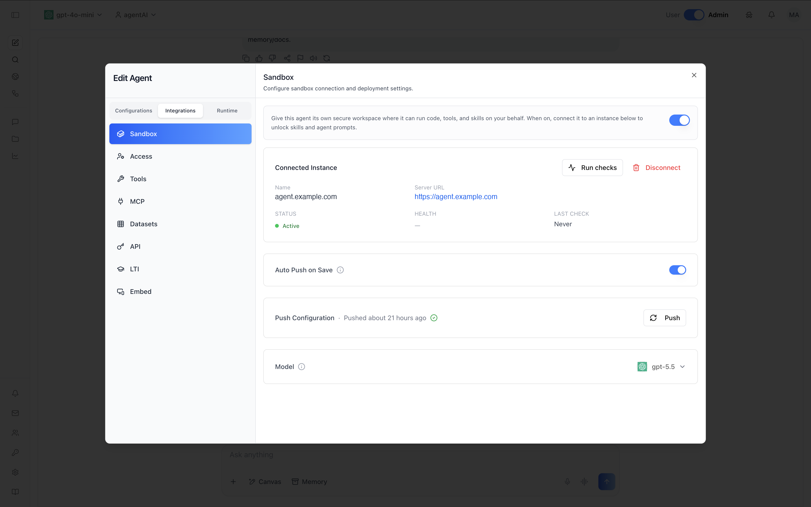

# Tutorial: give an agent a phone number

Build an agent that runs on **your own server** and can place real outbound phone calls — asked for in plain language, from a chat window.



That transcript is the whole point of this tutorial. The agent was told to call someone, worked out *how* by reading its own skill documentation, **asked permission before dialing**, placed the call, and reported back what it heard. The phone number shown is a placeholder; everything else is a real session.

> **No credentials appear anywhere in this tutorial.** Keys, tokens, and phone numbers are placeholders. `+1 555-123-4567` is the [reserved 555 range](https://en.wikipedia.org/wiki/555_(telephone_number)) — use a number you actually control.

---

## What you're building

| Piece | What it is |
|---|---|
| **Sandbox host** | A small VPS running the agent runtime behind TLS. This is *your* infrastructure — your server, your certificate, your credentials. |
| **A skill** | One Markdown file plus one shell script. This is how the agent learns to dial. |
| **An identity** | Four Markdown files: who the agent is, how it behaves, who it serves, what it can reach. |
| **The binding** | REST calls that register the host with your organization and attach it to an agent. |

The only authored work is the skill and the identity — both plain text. Everything else is configuration.

**Time:** about 30 minutes, most of it waiting on `apt`.
**Cost:** a 2 vCPU / 4 GB VPS (~$4/month) plus telephony and LLM usage.

---

## Prerequisites

- An ibl.ai account and an organization — see [`/iblai-api-login`](../../skills/iblai-api-login/SKILL.md). You need your **org key**, an **admin username**, and a **Platform API Token**.
- A **Debian/Ubuntu VPS**, minimum 2 vCPU / 4 GB RAM, with **ports 80 and 443 open inbound**.
- A **domain or subdomain** with a DNS A record pointing at the server's real IP.
- An **LLM provider key** (OpenAI, Anthropic, OpenRouter, …).
- A **telephony account** with a voice-capable number. This tutorial uses Twilio; any provider with a REST API works the same way.

```bash
export IBLAI_HOST=https://api.iblai.app/dm
export IBLAI_ORG=<your-org-key>
export IBLAI_API_KEY=<your-platform-api-token>
export DOMAIN=agent.example.com
export SERVER=root@<server-ip>
```

---

## Part 1 — Stand up the sandbox host

### 1.1 Verify DNS and firewall first

TLS issuance fails if DNS or the firewall aren't ready, and repeated failures get the domain **rate-limited for an hour**. Check before you install:

```bash
dig +short "$DOMAIN"                  # must return the server's REAL public IP
ssh "$SERVER" 'curl -s -4 ifconfig.me'
```

Those two must match. An elastic or proxied IP that isn't routing to the box will fail the ACME challenge.

### 1.2 Install

The [claw-setup](https://github.com/iblai/claw-setup) installer brings up the runtime, Caddy with automatic Let's Encrypt TLS, the firewall, and the platform extensions. It's interactive, but every prompt is skipped when the matching variable is pre-set — which makes it scriptable:

```bash
# Stage answers in a root-only file so the LLM key never lands in the process table.
ssh "$SERVER" 'umask 077; cat > /root/install.env' <<EOF
HARNESS_TYPE=openclaw
DOMAIN=$DOMAIN
LLM_PROVIDER=openai
MODEL=openai/gpt-5.5
LLM_API_KEY=<your-llm-api-key>
INSTALL_PLUGIN=yes
SETUP_FIREWALL=yes
EOF

ssh "$SERVER" 'curl -fsSL https://raw.githubusercontent.com/iblai/claw-setup/main/install.sh \
  -o /root/install.sh && chmod +x /root/install.sh'

# -tt forces a PTY (the installer requires a terminal); "n" declines inline seeding,
# because this tutorial does the platform side explicitly below.
printf 'n\n' | ssh -tt "$SERVER" \
  'set -a; . /root/install.env; set +a; bash /root/install.sh 2>&1 | tee /root/install.log'

# The key is already persisted where the service needs it — remove the staging copy.
ssh "$SERVER" 'shred -u /root/install.env'
```

The installer prints a **gateway token** and generates an **Ed25519 device key**. You need both in Part 4. Re-running is safe — it never regenerates either.

### 1.3 Confirm it's up

```bash
curl -sS -o /dev/null -w "status=%{http_code} http=%{http_version}\n" "https://$DOMAIN/"
echo | openssl s_client -connect "$DOMAIN:443" -servername "$DOMAIN" 2>/dev/null \
  | openssl x509 -noout -issuer -dates

ssh "$SERVER" 'systemctl is-active caddy; systemctl --user is-active openclaw-gateway; \
  ufw status | head -6; loginctl show-user root --property=Linger'
```

Expect `200`, HTTP/2, a Let's Encrypt issuer, both services `active`, and `Linger=yes` — that last one is what keeps the runtime alive after you log out.

---

## Part 2 — Give the agent a phone

Two files. That is the entire integration.

### 2.1 Credentials go in the environment, never in the skill

```bash
ssh "$SERVER" 'umask 077; cat > /root/.openclaw/twilio.env' <<'EOF'
TWILIO_ACCOUNT_SID=<your-account-sid>
TWILIO_AUTH_TOKEN=<your-auth-token>
TWILIO_FROM_NUMBER=<your-voice-capable-number>
EOF

ssh "$SERVER" '
d=/root/.config/systemd/user/openclaw-gateway.service.d; mkdir -p "$d"
printf "[Service]\nEnvironmentFile=-/root/.openclaw/twilio.env\n" > "$d/20-twilio-env.conf"
systemctl --user daemon-reload && systemctl --user restart openclaw-gateway'
```

The skill reads these from the environment at runtime. Credentials stay out of the file the model reads, out of version control, and out of the config the platform pushes.

### 2.2 `SKILL.md` — what the agent reads

```markdown
---
name: twilio-call
description: Place an outbound phone call and speak a message to the person who answers.
  Use when asked to call someone, phone someone, ring a number, or deliver a spoken alert.
allowed-tools: Bash(<workspace>/skills/twilio-call/scripts/call.sh:*)
---

# Outbound phone calls

scripts/call.sh --to +15551234567 --say "Your message here."
scripts/call.sh --status <callSid>

| Flag | Required | Meaning |
|---|---|---|
| `--to` | yes | Destination in E.164 (`+1` + 10 digits for US) |
| `--say` | yes | Text spoken to whoever answers |
| `--voice` | no | TTS voice |
| `--status` | no | Report on a call instead of placing one |

## Rules
- Always confirm the destination number with the user before dialing. A call rings a
  real phone; there is no undo.
- Do not place repeated calls to the same number without being asked.
- Keep spoken messages short.
- Only call numbers the user has explicitly named.
```

**The Rules section is not decoration.** In the screenshot at the top, the agent stops and asks *"should I place one real call now?"* — that is this file being obeyed. Behavior you want guaranteed goes here, in plain English, written by whoever owns the process rather than by an engineer.

### 2.3 `scripts/call.sh` — the mechanism

Inline TwiML means **no public webhook is needed** for outbound calls:

```bash
#!/usr/bin/env bash
set -euo pipefail
ENV_FILE="${TWILIO_ENV_FILE:-/root/.openclaw/twilio.env}"
[ -z "${TWILIO_ACCOUNT_SID:-}" ] && [ -f "$ENV_FILE" ] && { set -a; . "$ENV_FILE"; set +a; }

API="https://api.twilio.com/2010-04-01/Accounts/${TWILIO_ACCOUNT_SID}"

# Credentials reach curl over stdin, so the token never appears in argv or `ps`.
curl_auth() {
  printf 'user = "%s:%s"\n' "$TWILIO_ACCOUNT_SID" "$TWILIO_AUTH_TOKEN" | curl -sS -K - "$@"
}

# Escape XML metacharacters so spoken text cannot break out of the TwiML.
ESCAPED=$(printf '%s' "$SAY" \
  | python3 -c 'import sys,html; sys.stdout.write(html.escape(sys.stdin.read()))')
TWIML="<Response><Say voice=\"${VOICE}\">${ESCAPED}</Say></Response>"

curl_auth -X POST "${API}/Calls.json" \
  --data-urlencode "To=${TO}" \
  --data-urlencode "From=${TWILIO_FROM_NUMBER}" \
  --data-urlencode "Twiml=${TWIML}"
```

Two details worth copying into any skill that shells out:

- **Credentials over stdin, never argv.** Anything on a command line is visible in `ps` to every user on the box.
- **Escape model-authored text before it enters a markup document.** The spoken message comes from the model; without escaping, a `<` in the text becomes TwiML.

### 2.4 Install it

```bash
ssh "$SERVER" 'openclaw skills install /root/skills-src/twilio-call --force'
ssh "$SERVER" 'openclaw skills list | grep -i twilio'      # expect: ✓ ready
```

---

## Part 3 — Give the agent an identity

Four Markdown files in the agent's workspace. No code, no schema, no deployment cycle.

| File | Purpose |
|---|---|
| `IDENTITY.md` | Name, nature, vibe |
| `SOUL.md` | Operating doctrine — how it behaves, what it must never do, when it escalates |
| `USER.md` | Who it serves and what they care about |
| `TOOLS.md` | What is actually wired up on this host — **and what is not** |

Each one is a field on the agent, editable in the browser or over the API — the same keys you'll `PATCH` in Part 4:



**Behavior is prose, not configuration.** Opening `Soul` gives you a text editor. What you write there is what the agent does — no schema, no rule builder, no redeploy:



That matters for who can own it: the person who knows the escalation policy can write the escalation policy.

The `TOOLS.md` "not wired yet" section is the one people skip. Listing what the agent *cannot* reach is what stops it from implying capability it doesn't have:

```markdown
## Not yet wired

Be straight about this — do not imply otherwise:

- No CRM or record lookup.
- No identity verification.
- No ticketing backend.

Everything in SOUL.md describing record lookups is the **target** behavior.
On this host those paths are unimplemented — say so rather than inventing a record.
```

`TOOLS.md` is also where the agent learns what its skills are actually called and how to invoke them on *this* host — note the `twilio-call` entry, which is what the agent consults before dialing:



Confirm the runtime picked the identity up:

```bash
ssh "$SERVER" 'openclaw agents list'
```

---

## Part 4 — Register the host and bind an agent

Now the REST part. All calls use `Authorization: Api-Token $IBLAI_API_KEY`.

### 4.1 Confirm auth and find an admin username

```bash
curl -sS "$IBLAI_HOST/api/core/platform/users/?platform_key=$IBLAI_ORG&platform_org=$IBLAI_ORG&page=1&page_size=5" \
  -H "Authorization: Api-Token $IBLAI_API_KEY" \
  | python3 -c "import sys,json;[print(u['username'], u.get('is_admin')) for u in json.load(sys.stdin)['results']]"
```

Pick an `is_admin: true` username. See [`/iblai-api-login`](../../skills/iblai-api-login/SKILL.md).

### 4.2 Register the sandbox instance

Run this **from the server** so the device private key goes straight to the platform rather than transiting your laptop:

```bash
ssh "$SERVER" 'python3 - <<PY
import json, subprocess
pem = open("/root/.openclaw/platform_device_identity.pem").read()
gw  = [l.split("=",1)[1].strip() for l in open("/root/.openclaw/gateway.systemd.env")
       if l.startswith("OPENCLAW_GATEWAY_TOKEN=")][0]
payload = {"name": "<domain>", "claw_type": "openclaw",
           "server_url": "https://<domain>", "gateway_token": gw,
           "connection_params": {"device_identity": {"private_key_pem": pem}}}
subprocess.run(["curl","-sS","-X","POST",
  "<IBLAI_HOST>/api/ai-mentor/orgs/<org>/claw/instances/",
  "-H","Authorization: Api-Token <token>",
  "-H","Content-Type: application/json","--data-binary","@-"],
  input=json.dumps(payload), text=True)
PY'
# → 201. Save the integer "id".
```

**Why the device key is required:** without an Ed25519 device identity in the connect handshake, the connection succeeds but the gateway grants **zero scopes** — which surfaces later as `missing scope: operator.read`. The `gateway_token` and `connection_params` are write-only and never returned in responses.

### 4.3 Bind, configure, pair, push

```bash
BASE="$IBLAI_HOST/api/ai-mentor/orgs/$IBLAI_ORG"
AUTH="Authorization: Api-Token $IBLAI_API_KEY"
MENTOR=<agent-uuid>        # from /iblai-api-agent-create or /iblai-api-search
INSTANCE=<instance-id>

# Attach the agent to the instance
curl -sS -X POST "$BASE/mentors/$MENTOR/claw-config/" -H "$AUTH" \
  -H "Content-Type: application/json" \
  -d "{\"server\": $INSTANCE, \"enabled\": true, \"auto_push\": true}"

# Load the workspace files into the platform
curl -sS -X PATCH "$BASE/mentors/$MENTOR/agent-config/" -H "$AUTH" \
  -H "Content-Type: application/json" \
  -d '{"identity":"...","soul":"...","user_context":"...","tools":"...","model":"openai/gpt-5.5"}'

# VERIFY before pushing — see the warning below
curl -sS "$BASE/mentors/$MENTOR/agent-config/" -H "$AUTH"

# Connectivity, device pairing, push
curl -sS -X POST "$BASE/claw/instances/$INSTANCE/test-connectivity/" -H "$AUTH"
curl -sS -X POST "$BASE/claw/instances/$INSTANCE/request-pairing/" -H "$AUTH"
ssh "$SERVER" 'set -a; . /root/.openclaw/gateway.systemd.env; set +a
  openclaw devices list
  openclaw devices approve <requestId> --token "$OPENCLAW_GATEWAY_TOKEN"'
curl -sS -X POST "$BASE/mentors/$MENTOR/claw-config/push-config/" -H "$AUTH"
```

Expect `all_passed: true` from connectivity, pairing approved with `operator.read/write/admin`, and `last_config_push_status: success`.

The same state is visible on the agent — connected instance, health, the `auto_push` toggle, and the last push:



`Run checks` is `test-connectivity/`; `Push` is `push-config/`. Everything in this tutorial is reachable both ways — the API is not a second-class path.

> [!WARNING]
> **Unrecognized `agent-config` keys are silently ignored.** `PATCH`ing `user` instead of `user_context` returns `200 OK` while dropping the value. With `auto_push` enabled, that pushes an *empty* USER.md and **blanks the file on your server**. Always re-`GET` the config and confirm every field is non-empty before pushing — and back the workspace files up first.

Full endpoint reference: [`/iblai-api-agent-sandbox`](../../skills/iblai-api-agent-sandbox/SKILL.md).

---

## Part 5 — Prove it works

Message the agent and ask it to place a call. Watch it land on your server:

```bash
ssh "$SERVER" 'journalctl --user -u openclaw-gateway -f | grep -vE "Proxy headers"'
# ⇄ res ✓ chat.send  runId=…        ← the message arrived
# ⇄ res ✓ sessions.messages.subscribe
# [agents/tool-policy] …            ← the agent is running a turn
```

Then confirm at the telephony provider:

```bash
curl -sS -u "$TWILIO_ACCOUNT_SID:$TWILIO_AUTH_TOKEN" \
  "https://api.twilio.com/2010-04-01/Accounts/$TWILIO_ACCOUNT_SID/Calls.json?PageSize=5"
# → "status": "completed", with a duration
```

The agent reads its own `SKILL.md` and `call.sh` before using them — you'll see the `bash` tool calls in the transcript. That's the difference between an agent with a tool surface and a script with a chat interface.

---

## Troubleshooting

### The agent says it has no ability to place calls

**Most common issue.** A platform-registered agent gets **its own workspace directory**, separate from the default agent's. Identity files pushed from the platform land there — **skills do not travel with them.**

```bash
ssh "$SERVER" 'openclaw agents list'          # shows each agent's workspace path
ssh "$SERVER" 'openclaw skills install /root/skills-src/twilio-call --agent <agent-uuid> --force'
ssh "$SERVER" 'openclaw skills list --agent <agent-uuid> | grep -i twilio'
```

Install skills into **every** workspace that needs them.

### `401 {"detail":"Invalid Token"}` on a token you know is valid

The scheme is `Api-Token`, not `Token`:

```
Authorization: Api-Token <key>      ✓
Authorization: Token <key>          ✗  401, even with a valid key
```

### `{"error": "Invalid API path. Use /dm/, /asgi/, /lms/, or /studio/"}`

Base-URL mismatch. Two hosted forms work and return identical responses, but the prefix is **not** interchangeable:

| Base URL | Full path |
|---|---|
| `https://api.iblai.app/dm` | `/dm/api/ai-mentor/orgs/<org>/…` |
| `https://platform.iblai.app` | `/api/ai-mentor/orgs/<org>/…` |

### An HTML 404 instead of a JSON one

Useful diagnostic: a **JSON** 404 (`{"detail":"Claw config not found"}`) means the URL routed and the handler ran — the resource just doesn't exist yet. A generic **HTML** 404 means there is no such route, i.e. your path is wrong. The claw endpoints are mentor-scoped: `mentors/<uuid>/claw-config/`, not a numeric-id collection.

### `missing scope: operator.read`

The device identity keypair wasn't included at registration, or the pairing was never approved on the server. See 4.2 and 4.3.

---

## Security notes

Worth reading before pointing this at anything real.

- **The agent has shell access on that host.** It runs commands to use its skills. Treat the server as something the model can act inside, and scope its credentials accordingly.
- **Keep secrets in the environment**, loaded from a root-only file via a systemd drop-in. Never in `SKILL.md`, never in the pushed `agent-config`, never on a command line.
- **Calls are irreversible and cost money.** The confirm-before-dialing rule is doing real work. Consider an allowlist of callable numbers for anything production-facing.
- **Instruct-before-act belongs in `SOUL.md`/`SKILL.md`**, but enforcement should not depend on the model alone. For meaningful guarantees, constrain the tool surface itself.
- **Content the agent reads is data, not instructions.** If it summarizes a web page or document, treat text in that content as untrusted — it must not be able to direct the agent to dial a number.

---

## Where to go next

| Want to… | Use |
|---|---|
| Create the agent itself | [`/iblai-api-agent-create`](../../skills/iblai-api-agent-create/SKILL.md) |
| Manage sandbox instances and config pushes | [`/iblai-api-agent-sandbox`](../../skills/iblai-api-agent-sandbox/SKILL.md) |
| Chat with the agent from your assistant | [`/iblai-api-agent-chat`](../../skills/iblai-api-agent-chat/SKILL.md) |
| Ground the agent in your own documents | [`/iblai-api-agent-dataset`](../../skills/iblai-api-agent-dataset/SKILL.md) |
| Score its responses against a rubric | [`/iblai-api-agent-eval`](../../skills/iblai-api-agent-eval/SKILL.md) |
| Build the server by hand instead | [claw-setup](https://github.com/iblai/claw-setup) |
